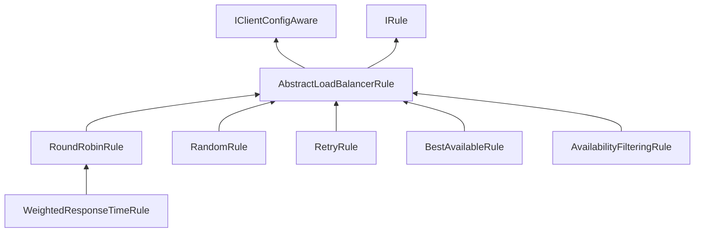

SpringCloud学习

---
[TOC]


---

## 入门

版本选择

上篇：SpirngBoot2.X版和SpringCloud H版
下篇：SpringCloud Alibaba版

SpringBoot,SpringCloud版本选择以及相互的版本依赖

| Release Train                                                | Boot Version                     |
| :----------------------------------------------------------- | :------------------------------- |
| [2020.0.x](https://github.com/spring-cloud/spring-cloud-release/wiki/Spring-Cloud-2020.0-Release-Notes) aka Ilford | 2.4.x                            |
| [Hoxton](https://github.com/spring-cloud/spring-cloud-release/wiki/Spring-Cloud-Hoxton-Release-Notes) | 2.2.x, 2.3.x (Starting with SR5) |
| [Greenwich](https://github.com/spring-projects/spring-cloud/wiki/Spring-Cloud-Greenwich-Release-Notes) | 2.1.x                            |
| [Finchley](https://github.com/spring-projects/spring-cloud/wiki/Spring-Cloud-Finchley-Release-Notes) | 2.0.x                            |
| [Edgware](https://github.com/spring-projects/spring-cloud/wiki/Spring-Cloud-Edgware-Release-Notes) | 1.5.x                            |
| [Dalston](https://github.com/spring-projects/spring-cloud/wiki/Spring-Cloud-Dalston-Release-Notes) | 1.5.x                            |

更详细的依赖：https://start.spring.io/actuator/info


组成框架（停更升级替换）（理念与落地实现）

1. 服务注册中心	
   1. Eureka（停更）
   2. Zookeeper（老项目）
   3. Consul
   4. Nacos（推荐）

1. 服务调用
   1. Ribbon（进入维护）
   2. LoadBalancer
2. 服务调用2
   1. Feign
   2. OpenFeign（推荐）
3. 服务降级
   1. Hystrix（国内大量使用，国外停用）
   2. resilience4j（国外）
   3. Sentinel（国内推荐）
4. 服务网关
   1. Zuul
   2. Spring Cloud Gateway（推荐）
5. 服务配置
   1. SpringCloud Config
   2. Apollo（携程）
   3. Nacos（推荐）
6. 消息总线
   1. Spring Cloud Bus
   2. Nacos


约定>配置>编码


## 搭建项目

搭建maven聚合项目

pom.xml文件

```xml
<?xml version="1.0" encoding="UTF-8"?>

<project xmlns="http://maven.apache.org/POM/4.0.0" xmlns:xsi="http://www.w3.org/2001/XMLSchema-instance"
         xsi:schemaLocation="http://maven.apache.org/POM/4.0.0 http://maven.apache.org/xsd/maven-4.0.0.xsd">
    <modelVersion>4.0.0</modelVersion>

    <!-- 坐标 -->
    <groupId>com.hyd.springcloud</groupId>
    <artifactId>cloud2021</artifactId>
    <version>1.0-SNAPSHOT</version>
    <!-- 打包类型：pom 聚合项目 -->
    <packaging>pom</packaging>

    <name>cloud2021</name>
    <!-- FIXME change it to the project's website -->
    <url>http://www.example.com</url>

    <!--统一管理jar包和版本-->
    <properties>
        <project.build.sourceEncoding>UTF-8</project.build.sourceEncoding>
        <maven.compiler.source>1.8</maven.compiler.source>
        <maven.compiler.target>1.8</maven.compiler.target>
        <junit.version>4.12</junit.version>
        <log4j.version>1.2.17</log4j.version>
        <lombok.version>1.16.18</lombok.version>
        <mysql.version>8.0.18</mysql.version>
        <druid.verison>1.1.16</druid.verison>
        <mybatis.spring.boot.verison>1.3.0</mybatis.spring.boot.verison>
    </properties>

    <!--子模块继承之后，提供作用：锁定版本+子module不用谢groupId和version-->
    <dependencyManagement>
        <dependencies>
            <!--spring boot 2.2.2-->
            <dependency>
                <groupId>org.springframework.boot</groupId>
                <artifactId>spring-boot-dependencies</artifactId>
                <version>2.2.2.RELEASE</version>
                <type>pom</type>
                <scope>import</scope>
            </dependency>
            <!--spring cloud Hoxton.SR1-->
            <dependency>
                <groupId>org.springframework.cloud</groupId>
                <artifactId>spring-cloud-dependencies</artifactId>
                <version>Hoxton.SR1</version>
                <type>pom</type>
                <scope>import</scope>
            </dependency>
            <!--spring cloud alibaba 2.1.0.RELEASE-->
            <dependency>
                <groupId>com.alibaba.cloud</groupId>
                <artifactId>spring-cloud-alibaba-dependencies</artifactId>
                <version>2.2.0.RELEASE</version>
                <type>pom</type>
                <scope>import</scope>
            </dependency>
            <!-- MySql -->
            <dependency>
                <groupId>mysql</groupId>
                <artifactId>mysql-connector-java</artifactId>
                <version>${mysql.version}</version>
            </dependency>
            <!-- Druid -->
            <dependency>
                <groupId>com.alibaba</groupId>
                <artifactId>druid-spring-boot-starter</artifactId>
                <version>${druid.verison}</version>
            </dependency>
            <!-- mybatis-springboot整合 -->
            <dependency>
                <groupId>org.mybatis.spring.boot</groupId>
                <artifactId>mybatis-spring-boot-starter</artifactId>
                <version>${mybatis.spring.boot.verison}</version>
            </dependency>
            <!--lombok-->
            <dependency>
                <groupId>org.projectlombok</groupId>
                <artifactId>lombok</artifactId>
                <version>${lombok.version}</version>
            </dependency>
            <!--junit-->
            <dependency>
                <groupId>junit</groupId>
                <artifactId>junit</artifactId>
                <version>${junit.version}</version>
            </dependency>
            <!-- log4j -->
            <dependency>
                <groupId>log4j</groupId>
                <artifactId>log4j</artifactId>
                <version>${log4j.version}</version>
            </dependency>
        </dependencies>
    </dependencyManagement>

</project>
```


dependencyManagement

maven中使用dependencyManagement元素来提供一种管理版本依赖号的方式。通常在一个组织或者项目的最顶层父POM中看到dependencyManagement元素。

使用pom.xml中的dependencyManagement元素，能够让所有在子项目引用一个依赖而不用显式的列出版本号。

dependencyManagement里只是声明依赖，并不实现引入，因此子项目需要显式的引入所需要的依赖。dependencyManagement只是起一个规范作用。如果不在子项目声明，是不会依赖的；只有子项目写了依赖，没有指定具体版本，才会继承父项目，读取version和scope。如果子项目写了版本号，则使用子项目的版本。


执行mvn:install将父工程发布到仓库方便子工程继承。 


### 支付模块

创建module子项目

pom.xml

```xml
<?xml version="1.0" encoding="UTF-8"?>
<project xmlns="http://maven.apache.org/POM/4.0.0"
         xmlns:xsi="http://www.w3.org/2001/XMLSchema-instance"
         xsi:schemaLocation="http://maven.apache.org/POM/4.0.0 http://maven.apache.org/xsd/maven-4.0.0.xsd">
    <parent>
        <artifactId>cloud2021</artifactId>
        <groupId>com.hyd.springcloud</groupId>
        <version>1.0-SNAPSHOT</version>
    </parent>
    <modelVersion>4.0.0</modelVersion>

    <artifactId>cloud-provider-payment8001</artifactId>

    <properties>
        <maven.compiler.source>1.8</maven.compiler.source>
        <maven.compiler.target>1.8</maven.compiler.target>
    </properties>


    <dependencies>
        <!-- web依赖 -->
        <dependency>
            <groupId>org.springframework.boot</groupId>
            <artifactId>spring-boot-starter-web</artifactId>
        </dependency>
        <!--监控-->
        <dependency>
            <groupId>org.springframework.boot</groupId>
            <artifactId>spring-boot-starter-actuator</artifactId>
        </dependency>
        <!-- mybatis依赖 -->
        <dependency>
            <groupId>org.mybatis.spring.boot</groupId>
            <artifactId>mybatis-spring-boot-starter</artifactId>
        </dependency>

        <!-- 数据库连接池 -->
        <dependency>
            <groupId>com.alibaba</groupId>
            <artifactId>druid-spring-boot-starter</artifactId>
            <!--如果没写版本,从父层面找,找到了就直接用,全局统一-->
        </dependency>
        <!--mysql-connector-java-->
        <dependency>
            <groupId>mysql</groupId>
            <artifactId>mysql-connector-java</artifactId>
        </dependency>
        <!--jdbc-->
        <dependency>
            <groupId>org.springframework.boot</groupId>
            <artifactId>spring-boot-starter-jdbc</artifactId>
        </dependency>
        <!--热部署-->
        <dependency>
            <groupId>org.springframework.boot</groupId>
            <artifactId>spring-boot-devtools</artifactId>
            <scope>runtime</scope>
            <optional>true</optional>
        </dependency>
        <dependency>
            <groupId>org.projectlombok</groupId>
            <artifactId>lombok</artifactId>
            <optional>true</optional>
        </dependency>
        <dependency>
            <groupId>org.springframework.boot</groupId>
            <artifactId>spring-boot-starter-test</artifactId>
            <scope>test</scope>
        </dependency>
    </dependencies>

</project>
```


application.yaml

```yaml
server:
  port: 8001
spring:
  application:
    name: cloud-payment-service
  datasource:
    # 当前数据源操作类型
    type: com.alibaba.druid.pool.DruidDataSource
    # mysql驱动类
    driver-class-name: com.mysql.jdbc.Driver
    url: jdbc:mysql://localhost:3306/cloud2021?useUnicode=true&characterEncoding=UTF-8&useSSL=false
    username: root
    password: 123456
mybatis:
  mapper-locations: classpath*:mapper/*.xml
  type-aliases-package: com.hyd.springcloud.entity
```


启动类：

```java
package com.hyd.springcloud;

import org.springframework.boot.SpringApplication;
import org.springframework.boot.autoconfigure.SpringBootApplication;

/**
 * 微服务提供者支付模块
 */
@SpringBootApplication
public class PaymentMain8001 {
    public static void main(String[] args) {
        SpringApplication.run(PaymentMain8001.class,args);
    }
}

```


建表sql

```mysql
CREATE TABLE `payment`(
    `id` bigint(20) NOT NULL AUTO_INCREMENT COMMENT 'ID',
    `serial` varchar(200) DEFAULT '',
    PRIMARY KEY(`id`)
)ENGINE=InnoDB AUTO_INCREMENT=1 DEFAULT CHARSET=utf8
```


实体类

```java
package com.hyd.springcloud.entity;

import lombok.AllArgsConstructor;
import lombok.Data;
import lombok.NoArgsConstructor;

@Data
@AllArgsConstructor
@NoArgsConstructor
public class CommonResult<T> {
    private Integer code;
    private String message;
    private T data;

    public CommonResult(Integer code,String message){
        this(code,message,null);
    }
}

```


```java
package com.hyd.springcloud.entity;

import lombok.AllArgsConstructor;
import lombok.Data;
import lombok.NoArgsConstructor;

import java.io.Serializable;

@Data
@AllArgsConstructor
@NoArgsConstructor
public class Payment implements Serializable {
    private Long id;
    private String serial;
}

```


dao层

```java
package com.hyd.springcloud.dao;

import com.hyd.springcloud.entity.Payment;
import org.apache.ibatis.annotations.Mapper;
import org.apache.ibatis.annotations.Param;

@Mapper
public interface PaymentDao {
    int create(Payment payment);
    Payment getPaymentById(@Param("id") Long id);
}

```


PaymentMapper.xml

```xml
<?xml version="1.0" encoding="UTF-8" ?>
<!DOCTYPE mapper PUBLIC "-//mybatis.org//DTD Mapper 3.0//EN" "http://mybatis.org/dtd/mybatis-3-mapper.dtd">
<mapper namespace="com.hyd.springcloud.dao.PaymentDao">
    <resultMap id="BaseResultMap" type="com.hyd.springcloud.entity.Payment">
        <id column="id" property="id" jdbcType="BIGINT" />
        <id column="serial" property="serial" jdbcType="VARCHAR"/>
    </resultMap>

    <insert id="create" parameterType="Payment" useGeneratedKeys="true" keyProperty="id">
        insert into payment(serial) values(#{serial})
    </insert>

    <select id="getPaymentById" parameterType="Long" resultMap="BaseResultMap">
        select id,serial from payment where id=#{id};
    </select>
</mapper>
```


service层

```java
package com.hyd.springcloud.service;

import com.hyd.springcloud.entity.Payment;
import org.apache.ibatis.annotations.Param;

public interface PaymentService {
    int create(Payment payment);
    Payment getPaymentById(@Param("id") Long id);
}

```


serviceImpl实现类

```java
package com.hyd.springcloud.service.impl;

import com.hyd.springcloud.dao.PaymentDao;
import com.hyd.springcloud.entity.Payment;
import com.hyd.springcloud.service.PaymentService;
import org.springframework.beans.factory.annotation.Autowired;
import org.springframework.stereotype.Service;

@Service
public class PaymentServiceImpl implements PaymentService {

    @Autowired
    private PaymentDao paymentDao;
    @Override
    public int create(Payment payment) {
        return paymentDao.create(payment);
    }

    @Override
    public Payment getPaymentById(Long id) {
        return paymentDao.getPaymentById(id);
    }
}

```


controller层

```java
package com.hyd.springcloud.controller;

import com.hyd.springcloud.entity.CommonResult;
import com.hyd.springcloud.entity.Payment;
import com.hyd.springcloud.service.PaymentService;
import lombok.extern.slf4j.Slf4j;
import org.springframework.beans.factory.annotation.Autowired;
import org.springframework.web.bind.annotation.*;

@RestController
@Slf4j
@RequestMapping(value = "/payment")
public class PaymentController {

    @Autowired
    private PaymentService paymentService;

    @PostMapping(value = "/create")
    public CommonResult create(@RequestBody Payment payment){
        int result = paymentService.create(payment);
        log.info("插入结果：-->{}",result);

        if(result>0){
            return new CommonResult(200,"插入数据库成功",result);
        }else {
            return new CommonResult(444,"插入数据库失败");
        }
    }
    @GetMapping("/get/{id}")
    public CommonResult getPaymentById(@PathVariable("id") Long id){
        Payment payment = paymentService.getPaymentById(id);
        log.info("查询结果：-->{}",payment);
        if(payment!=null){
            return new CommonResult(200,"查询成功",payment);
        }else {
            return new CommonResult(444,"无记录");
        }
    }
}

```


### 订单模块

创建moudel子项目

pom.xml

```xml
<?xml version="1.0" encoding="UTF-8"?>
<project xmlns="http://maven.apache.org/POM/4.0.0"
         xmlns:xsi="http://www.w3.org/2001/XMLSchema-instance"
         xsi:schemaLocation="http://maven.apache.org/POM/4.0.0 http://maven.apache.org/xsd/maven-4.0.0.xsd">
    <parent>
        <artifactId>cloud2021</artifactId>
        <groupId>com.hyd.springcloud</groupId>
        <version>1.0-SNAPSHOT</version>
    </parent>
    <modelVersion>4.0.0</modelVersion>

    <artifactId>cloud-consumer-order80</artifactId>

    <properties>
        <maven.compiler.source>1.8</maven.compiler.source>
        <maven.compiler.target>1.8</maven.compiler.target>
    </properties>

    <dependencies>
        <dependency>
            <groupId>org.springframework.boot</groupId>
            <artifactId>spring-boot-starter-web</artifactId>
        </dependency>
        <dependency>
            <groupId>org.springframework.boot</groupId>
            <artifactId>spring-boot-starter-actuator</artifactId>
        </dependency>

        <dependency>
            <groupId>org.springframework.boot</groupId>
            <artifactId>spring-boot-devtools</artifactId>
            <scope>runtime</scope>
            <optional>true</optional>
        </dependency>
        <dependency>
            <groupId>org.projectlombok</groupId>
            <artifactId>lombok</artifactId>
            <optional>true</optional>
        </dependency>
        <dependency>
            <groupId>org.springframework.boot</groupId>
            <artifactId>spring-boot-starter-test</artifactId>
            <scope>test</scope>
        </dependency>
    </dependencies>

</project>
```


application.yaml

```yaml
server:
  port: 80
```


启动类，entity实体类同支付模块，略


controller层


服务之间调用：httpcilent --> restTemplate

RestTemplate介绍

 原本发送Http请求我们会使用封装好的HttpClient工具类，而Spring为我们提供了RestTemplate工具集。它提供了多种便携访问远程Http服务的方法，是一种简单便捷的访问restful服务模板类。类似于jdbcTemplate,redisTemplate。


配置类

```java
package com.hyd.springcloud.config;

import org.springframework.context.annotation.Bean;
import org.springframework.context.annotation.Configuration;
import org.springframework.web.client.RestTemplate;

/**
 * 配置类
 */
@Configuration
public class ApplicationContextConfig {

    @Bean
    public RestTemplate getRestTemplate(){
        return new RestTemplate();
    }
}

```


这里create时，通过get方式提交json数据，通过requestbody接收，服务调用时，通过post方式提交,requestbody接收

```java
package com.hyd.springcloud.controller;

import com.hyd.springcloud.entity.CommonResult;
import com.hyd.springcloud.entity.Payment;
import lombok.extern.slf4j.Slf4j;
import org.springframework.beans.factory.annotation.Autowired;
import org.springframework.web.bind.annotation.*;
import org.springframework.web.client.RestTemplate;

@RestController
@Slf4j
@RequestMapping(value = "/consumer/payment")
public class OrderController {

    public static final String PAYMENT_URL="http://localhost:8001";

    @Autowired
    private RestTemplate restTemplate;

    @GetMapping(value = "/create")
    public CommonResult<Payment> create(@RequestBody Payment payment){
        return restTemplate.postForObject(PAYMENT_URL+"/payment/create",payment,CommonResult.class);
    }

    @GetMapping("/get/{id}")
    public CommonResult<Payment> getPaymentById(@PathVariable("id") Long id){
        return restTemplate.getForObject(PAYMENT_URL+"/payment/get/"+id,CommonResult.class);
    }
}

```


小知识：通过**Run Dashboard**快速管理服务启动等。

以上支付模块调用订单模块基本完成。但存在冗余代码。


### 代码重构：

创建moudel子模块，名为cloud-api-commons，提取公共通用类

pom.xml

```xml
<?xml version="1.0" encoding="UTF-8"?>
<project xmlns="http://maven.apache.org/POM/4.0.0"
         xmlns:xsi="http://www.w3.org/2001/XMLSchema-instance"
         xsi:schemaLocation="http://maven.apache.org/POM/4.0.0 http://maven.apache.org/xsd/maven-4.0.0.xsd">
    <parent>
        <artifactId>cloud2021</artifactId>
        <groupId>com.hyd.springcloud</groupId>
        <version>1.0-SNAPSHOT</version>
    </parent>
    <modelVersion>4.0.0</modelVersion>

    <artifactId>cloud-api-commons</artifactId>

    <properties>
        <maven.compiler.source>1.8</maven.compiler.source>
        <maven.compiler.target>1.8</maven.compiler.target>
    </properties>

    <dependencies>
        <dependency>
            <groupId>org.springframework.boot</groupId>
            <artifactId>spring-boot-devtools</artifactId>
            <scope>runtime</scope>
            <optional>true</optional>
        </dependency>
        <dependency>
            <groupId>org.projectlombok</groupId>
            <artifactId>lombok</artifactId>
            <optional>true</optional>
        </dependency>
        <dependency>
            <groupId>cn.hutool</groupId>
            <artifactId>hutool-all</artifactId>
            <version>5.1.0</version>
        </dependency>
    </dependencies>

</project>
```


提取支付模块和订单模块公共entity类，删除两个工程原项目下的entity包，提取到cloud-api-commons模块下。，并将cloud-api-commons依赖引入两个模块中，以便调用公共entity类。maven clean install该模块。

```xml
        <!-- 引入公共commons模块 -->
        <dependency>
            <groupId>com.hyd.springcloud</groupId>
            <artifactId>cloud-api-commons</artifactId>
            <version>1.0-SNAPSHOT</version>
        </dependency>
```


---


微服务-初级


## 服务注册中心


### Eureka服务注册与发现

#### Eureka基础知识

###### 什么是服务注册中心：

* 在环境搭建中，我们实现了服务模块直接通过Http的方式进行调用。而当我们的服务越来越多时就会不方便管理（服务运行状态等等），所以将这些服务在某个地方注册并进行统一的管理，这个地方就是我们的服务注册中心。

###### 什么是服务治理：

* Spring Cloud封装了Netflix 公司开发的Eureka模块来实现服务治理

  在传统的RPC远程调用框架中，管理每个服务与服务之间依赖关系比较复杂，管理比较复杂，所以需要使用服务治理，管理服务于服务之间依赖关系，可以实现服务调用、负载均衡、容错等，实现服务发现与注册。

###### 什么是服务注册与发现：

* Eureka采用了CS的设计架构，Eureka Sever作为服务注册功能的服务器，它是服务注册中心。而系统中的其他微服务，使用Eureka的客户端连接到 Eureka Server并维持心跳连接。这样系统的维护人员就可以通过Eureka Server来监控系统中各个微服务是否正常运行。

  在服务注册与发现中，有一个注册中心。当服务器启动的时候，会把当前自己服务器的信息比如服务地址通讯地址等以别名方式注册到注册中心上。另一方(消费者服务提供者)，以该别名的方式去注册中心上获取到实际的服务通讯地址，然后再实现本地RPC调用RPC远程调用框架核心设计思想:在于注册中心，因为使用注册中心管理每个服务与服务之间的一个依赖关系(服务治理概念)。在任何RPC远程框架中，都会有一个注册中心存放服务地址相关信息(接口地址)。

* 可以对比Eureka和Dubbo框架。

配置集群为了避免单点故障。


###### Eureka包含两个组件:Eureka Server和Eureka Client

* Eureka Server提供服务注册服务

  各个微服务节点通过配置启动后，会在EurekaServer中进行注册，这样EurekaServer中的服务注册表中将会存储所有可用服务节点的信息，服务节点的信息可以在界面中直观看到。

* EurekaClient通过注册中心进行访问

  它是一个Java客户端，用于简化Eureka Server的交互，客户端同时也具备一个内置的、使用轮询(round-robin)负载算法的负载均衡器。在应用启动后，将会向Eureka Server发送心跳(默认周期为30秒)。如果Eureka Server在多个心跳周期内没有接收到某个节点的心跳，EurekaServer将会从服务注册表中把这个服务节点移除（默认90秒)。


#### 单机版Eureka构建步骤


Eureka版本选择(spring-cloud-starter-eureka和spring-cloud-starter-netflix-eureka-server):

```xml
<!-- https://mvnrepository.com/artifact/org.springframework.cloud/spring-cloud-starter-eureka -->
<dependency>
    <groupId>org.springframework.cloud</groupId>
    <artifactId>spring-cloud-starter-eureka</artifactId>
    <version>1.4.7.RELEASE</version>
</dependency>
```


```xml
<!-- https://mvnrepository.com/artifact/org.springframework.cloud/spring-cloud-starter-netflix-eureka-server -->
<dependency>
    <groupId>org.springframework.cloud</groupId>
    <artifactId>spring-cloud-starter-netflix-eureka-server</artifactId>
    <version>2.2.8.RELEASE</version>
</dependency>
```


spring-cloud-starter-eureka-server 在1.5版本中可以使用，

在2.0版本中废弃，建议使用spring-cloud-starter-netflix-eureka-server


##### 创建moudle子模块

pom.xml

```xml
<?xml version="1.0" encoding="UTF-8"?>
<project xmlns="http://maven.apache.org/POM/4.0.0"
         xmlns:xsi="http://www.w3.org/2001/XMLSchema-instance"
         xsi:schemaLocation="http://maven.apache.org/POM/4.0.0 http://maven.apache.org/xsd/maven-4.0.0.xsd">
    <parent>
        <artifactId>cloud2021</artifactId>
        <groupId>com.hyd.springcloud</groupId>
        <version>1.0-SNAPSHOT</version>
    </parent>
    <modelVersion>4.0.0</modelVersion>
    <artifactId>cloud-eureka-server7001</artifactId>

    <dependencies>
        <!--eureka-server-->
        <dependency>
            <groupId>org.springframework.cloud</groupId>
            <artifactId>spring-cloud-starter-netflix-eureka-server</artifactId>
        </dependency>
        <!-- 引入自己定义的api通用包，可以使用Payment支付Entity -->
        <dependency>
            <groupId>com.hyd.springcloud</groupId>
            <artifactId>cloud-api-commons</artifactId>
            <version>1.0-SNAPSHOT</version>
        </dependency>
        <!--boot web actuator-->
        <dependency>
            <groupId>org.springframework.boot</groupId>
            <artifactId>spring-boot-starter-web</artifactId>
        </dependency>
        <dependency>
            <groupId>org.springframework.boot</groupId>
            <artifactId>spring-boot-starter-actuator</artifactId>
        </dependency>
        <!--一般通用配置-->
        <dependency>
            <groupId>org.springframework.boot</groupId>
            <artifactId>spring-boot-devtools</artifactId>
            <scope>runtime</scope>
            <optional>true</optional>
        </dependency>
        <dependency>
            <groupId>org.projectlombok</groupId>
            <artifactId>lombok</artifactId>
        </dependency>
        <dependency>
            <groupId>org.springframework.boot</groupId>
            <artifactId>spring-boot-starter-test</artifactId>
            <scope>test</scope>
        </dependency>
        <dependency>
            <groupId>junit</groupId>
            <artifactId>junit</artifactId>
        </dependency>
    </dependencies>
</project>
```


application.yaml

```yaml
server:
  port: 7001

eureka:
  instance:
    hostname: localhost #eureka服务端的实例名称
  client:
    register-with-eureka: false #false表示不向注册中心注册自己
    fetch-registry: false #false表示自己端就是注册中心，我的职责就是维护服务实例，并不需要去检索服务
    service-url: #设置与Eureka server交互的地址查询服务和注册服务都需要依赖这个地址。
      defaultZone: http://${eureka.instance.hostname}:${server.port}/eureka/
```


启动类

```java
package com.hyd.springcloud;

import org.springframework.boot.SpringApplication;
import org.springframework.boot.autoconfigure.SpringBootApplication;
import org.springframework.cloud.netflix.eureka.server.EnableEurekaServer;

/**
 * Eureka 服务注册中心
 */
@SpringBootApplication
@EnableEurekaServer //表明此为Eureka 服务注册中心服务端
public class EurekaMain7001 {
    public static void main(String[] args) {
        SpringApplication.run(EurekaMain7001.class,args);
    }
}

```


启动之后访问 http://localhost:7001 查看。


##### 注册支付模块和订单模块


改造支付模块和订单模块

引入依赖

```xml
        <!-- eureka client -->
        <dependency>
            <groupId>org.springframework.cloud</groupId>
            <artifactId>spring-cloud-starter-netflix-eureka-client</artifactId>
        </dependency>
```


修改application.yaml，添加以下配置

```yaml
eureka:
  client:
    #表示是否将自己注册进Eurekaserver默认为true。
    register-with-eureka: true
    #是否从EurekaServer抓取已有的注册信息，默认为true。单节点无所谓，集群必须设置为true才能配合ribbon使用负载均衡
    fetchRegistry: true
    service-url:
      defaultZone: http://localhost:7001/eureka
```


启动类添加`@EnableEurekaClient`注解：

```java
package com.hyd.springcloud;

import org.springframework.boot.SpringApplication;
import org.springframework.boot.autoconfigure.SpringBootApplication;
import org.springframework.cloud.netflix.eureka.EnableEurekaClient;

/**
 * 微服务提供者支付模块
 */
@SpringBootApplication
@EnableEurekaClient
public class PaymentMain8001 {
    public static void main(String[] args) {
        SpringApplication.run(PaymentMain8001.class,args);
    }
}

```


服务实例名称

```yaml
spring:
  application:
    name: cloud-payment-service
```


注册到Eureka中的**CLOUD-PAYMENT-SERVICE**，就是yaml配置的**cloud-payment-service**


Eureka自我保护机制：

EMERGENCY! EUREKA MAY BE INCORRECTLY CLAIMING INSTANCES ARE UP WHEN THEY'RE NOT. RENEWALS ARE LESSER THAN THRESHOLD AND HENCE THE INSTANCES ARE NOT BEING EXPIRED JUST TO BE SAFE.

紧急情况！EUREKA可能错误地声称实例在没有启动的情况下启动了。续订小于阈值，因此实例不会为了安全而过期。


#### 集群Eureka搭建步骤


1.Eureka集群原理说明

服务注册：将服务信息注册进注册中心

服务发现：从注册中心上获取服务信息

实质：存key服务命取value闭用地址

1先启动eureka注主册中心

2启动服务提供者payment支付服务

3支付服务启动后会把自身信息(比服务地址L以别名方式注朋进eureka

4消费者order服务在需要调用接口时，使用服务别名去注册中心获取实际的RPC远程调用地址

5消去者导调用地址后，底屋实际是利用HttpClient技术实现远程调用

6消费者实癸导服务地址后会缓存在本地jvm内存中，默认每间隔30秒更新—次服务调用地址

问题:微服务RPC远程服务调用最核心的是什么
高可用，试想你的注册中心只有一个only one，万一它出故障了，会导致整个为服务环境不可用。

解决办法：搭建Eureka注册中心集群，实现负载均衡+故障容错。

互相注册，相互守望。


##### 创建子模块

再创建两个Eureka module子模块

略

现在有了三个Eureka模块cloud-eureka-server7001,cloud-eureka-server7002,cloud-eureka-server7002搭建集群，接下来进行下一步操作。

修改Windows host 文件(C:\Windows\System32\drivers\etc)

```
# Eureka映射配置(SpringCloud学习)
127.0.0.1       cloud-eureka-server7001
127.0.0.1       cloud-eureka-server7002
127.0.0.1       cloud-eureka-server7003
```


修改Eureka服务端三个配置文件(application.yaml)

```yaml
server:
  port: 7001

eureka:
  instance:
    hostname: cloud-eureka-server7001 #eureka服务端的实例名称
  client:
    register-with-eureka: false #false表示不向注册中心注册自己
    fetch-registry: false #false表示自己端就是注册中心，我的职责就是维护服务实例，并不需要去检索服务
    service-url: #设置与Eureka server交互的地址查询服务和注册服务都需要依赖这个地址。
      #defaultZone: http://${eureka.instance.hostname}:${server.port}/eureka/ #单机配置
      defaultZone: http://cloud-eureka-server7002:7002/eureka/, http://cloud-eureka-server7003:7003/eureka/ # 集群相互注册
```


```yaml
server:
  port: 7002

eureka:
  instance:
    hostname: cloud-eureka-server7002 #eureka服务端的实例名称
  client:
    register-with-eureka: false #false表示不向注册中心注册自己
    fetch-registry: false #false表示自己端就是注册中心，我的职责就是维护服务实例，并不需要去检索服务
    service-url: #设置与Eureka server交互的地址查询服务和注册服务都需要依赖这个地址。
      #defaultZone: http://${eureka.instance.hostname}:${server.port}/eureka/ #单机配置
      defaultZone: http://cloud-eureka-server7001:7001/eureka/, http://cloud-eureka-server7003:7003/eureka/ # 集群相互注册
```


```yaml
server:
  port: 7003

eureka:
  instance:
    hostname: cloud-eureka-server7003 #eureka服务端的实例名称
  client:
    register-with-eureka: false #false表示不向注册中心注册自己
    fetch-registry: false #false表示自己端就是注册中心，我的职责就是维护服务实例，并不需要去检索服务
    service-url: #设置与Eureka server交互的地址查询服务和注册服务都需要依赖这个地址。
      #defaultZone: http://${eureka.instance.hostname}:${server.port}/eureka/ #单机配置
      defaultZone: http://cloud-eureka-server7001:7001/eureka/, http://cloud-eureka-server7002:7002/eureka/ # 集群相互注册
```


启动三个服务，访问以下网址

```http
#Eureka
http://localhost:7001/
http://localhost:7002/
http://localhost:7003/
http://cloud-eureka-server7001:7001/
http://cloud-eureka-server7002:7002/
http://cloud-eureka-server7003:7003/
```

会发现分别对应另外两个地址，现阶段配置完成。


#### 支付服务提供者集群环境搭建


新建两个module子模块，修改端口号，组成三个支付服务提供集群：cloud-provider-payment8001,cloud-provider-payment8002,cloud-provider-payment8003


此时启动服务访问订单模块，会发现始终访问8001端口的项目，其实是由于代码之前都是写死的地址导致。修改为服务名。

```java
//    public static final String PAYMENT_URL="http://localhost:8001";//服务提供者单机版
    public static final String PAYMENT_URL="http://CLOUD-PAYMENT-SERVICE";//服务提供者集群环境
```

到这一步，再访问，会报错：

```
"status": 500,
"error": "Internal Server Error",
"message": "I/O error on GET request for \"http://CLOUD-PAYMENT-SERVICE/payment/get/11\": CLOUD-PAYMENT-SERVICE; nested exception is java.net.UnknownHostException: CLOUD-PAYMENT-SERVICE",
```

负载均衡：

使用@LoadBalanced注解赋予RestTemplate负载均衡的能力

Ribbon作为Spring Cloud的负载均衡机制的实现，使用@LoadBalanced让RestTemplate使用相关的负载均衡策略。

```java
package com.hyd.springcloud.config;

import org.springframework.cloud.client.loadbalancer.LoadBalanced;
import org.springframework.context.annotation.Bean;
import org.springframework.context.annotation.Configuration;
import org.springframework.web.client.RestTemplate;

/**
 * 配置类
 */
@Configuration
public class ApplicationContextConfig {

    @Bean
    @LoadBalanced
    public RestTemplate getRestTemplate(){
        return new RestTemplate();
    }
}

```


此时访问服务，默认根据轮询机制，调用端口为8001,8002,8003的服务。

此时的服务访问形势如下：

订单模块 --> Eureka(集群) --> 支付模块(集群)


#### actuator微服务信息完善

服务名称修改，访问信息有ip提示：

当前服务含有主机名称：[PIG:cloud-payment-service:8001](http://pig:8001/actuator/info) , [PIG:cloud-payment-service:8002](http://pig:8002/actuator/info) , [PIG:cloud-payment-service:8003](http://pig:8003/actuator/info)，并且当前鼠标停留在服务字段上没有ip显示

修改三个模块application.yaml，新增配置字段

```yaml
eureka:
  instance:
    instance-id: payment8003
```

修改后服务：[payment8003](http://pig:8003/actuator/info) , [payment8002](http://pig:8002/actuator/info) , [payment8001](http://pig:8001/actuator/info)

访问信息有ip提示http://pig:8003/actuator/info --> http://192.168.1.102:8003/actuator/info


#### 服务发现Discovery

对于注册进eureka里面的微服务，可以通过服务发现来获得该服务的信息


注入DiscoverClient服务发现客户端，写一个服务信息查询接口

```java
    @Autowired
    private DiscoveryClient discoveryClient;


    @GetMapping("/discovery")
    public Object discovery() {
        //获取服务列表
        List<String> services = discoveryClient.getServices();
        for (String service : services) {
            log.info("service ---> {}", service);
        }

        //获取具体服务下的实例列表
        List<ServiceInstance> instances = discoveryClient.getInstances("CLOUD-PAYMENT-SERVICE");
        for (ServiceInstance instance : instances) {
            log.info(instance.getServiceId() + " ," + instance.getInstanceId() + " ," + instance.getHost() + " ," + instance.getPort() + " ," + instance.getUri());
            ;
        }

        return this.discoveryClient;

    }
}

```

启动类添加注解

```java
@SpringBootApplication
@EnableEurekaClient
@EnableDiscoveryClient //添加服务发现注解
public class PaymentMain8001 {
    public static void main(String[] args) {
        SpringApplication.run(PaymentMain8001.class,args);
    }
}
```


启动服务访问 http://localhost:8001/payment/discovery

返回以下内容:

```java
{
    "discoveryClients": [
        {
            "services": [
                "cloud-payment-service",
                "cloud-order-service"
            ],
            "order": 0
        },
        {
            "services": [],
            "order": 0
        }
    ],
    "services": [
        "cloud-payment-service",
        "cloud-order-service"
    ],
    "order": 0
}
```


后台打印内容：

```
service ---> cloud-payment-service
service ---> cloud-order-service
CLOUD-PAYMENT-SERVICE ,payment8001 ,192.168.1.103 ,8001 ,http://192.168.1.103:8001
CLOUD-PAYMENT-SERVICE ,payment8003 ,192.168.1.103 ,8003 ,http://192.168.1.103:8003
CLOUD-PAYMENT-SERVICE ,payment8002 ,192.168.1.103 ,8002 ,http://192.168.1.103:8002
```


#### Eureka自我保护

##### 概述

保护模式主要用于一组客户端和Eureka Server之间存在网络分区场景下的保护。一旦进入保护模式，Eureka Server将会尝试保护其服务注册表中的信息，不再删除服务注册表中的数据，也就是不会注销任何微服务。

如果在Eureka Server的首页看到以下这段提示，则说明Eureka进入了保护模式:

EMERGENCY! EUREKA MAY BE INCORRECTLY CLAIMING INSTANCES ARE UP WHEN THEY’RE NOT. RENEWALS ARE LESSER THANTHRESHOLD AND HENCE THE INSTANCES ARE NOT BEING EXPIRED JUSTTO BE SAFE

##### 导致原因

一句话：某时刻某一个微服务不可用了，Eureka不会立刻清理，依旧会对该微服务的信息进行保存。

属于CAP里面的AP分支。

##### 为什么会产生Eureka自我保护机制?

为了EurekaClient可以正常运行，防止与EurekaServer网络不通情况下，EurekaServer不会立刻将EurekaClient服务剔除

##### 什么是自我保护模式?

默认情况下，如果EurekaServer在一定时间内没有接收到某个微服务实例的心跳，EurekaServer将会注销该实例(默认90秒)。但是当网络分区故障发生(延时、卡顿、拥挤)时，微服务与EurekaServer之间无法正常通信，以上行为可能变得非常危险了——因为微服务本身其实是健康的，此时本不应该注销这个微服务。Eureka通过“自我保护模式”来解决这个问题——当EurekaServer节点在短时间内丢失过多客户端时(可能发生了网络分区故障)，那么这个节点就会进入自我保护模式。

自我保护机制∶默认情况下EurekaClient定时向EurekaServer端发送心跳包

如果Eureka在server端在一定时间内(默认90秒)没有收到EurekaClient发送心跳包，便会直接从服务注册列表中剔除该服务，但是在短时间( 90秒中)内丢失了大量的服务实例心跳，这时候Eurekaserver会开启自我保护机制，不会剔除该服务（该现象可能出现在如果网络不通但是EurekaClient为出现宕机，此时如果换做别的注册中心如果一定时间内没有收到心跳会将剔除该服务，这样就出现了严重失误，因为客户端还能正常发送心跳，只是网络延迟问题，而保护机制是为了解决此问题而产生的)。

在自我保护模式中，Eureka Server会保护服务注册表中的信息，不再注销任何服务实例。

它的设计哲学就是宁可保留错误的服务注册信息，也不盲目注销任何可能健康的服务实例。一句话讲解：好死不如赖活着。

综上，自我保护模式是一种应对网络异常的安全保护措施。它的架构哲学是宁可同时保留所有微服务（健康的微服务和不健康的微服务都会保留）也不盲目注销任何健康的微服务。使用自我保护模式，可以让Eureka集群更加的健壮、稳定。


设计思想：分布式CAP里边的AP分支


##### 自我保护模式配置

默认自我保护模式是开启的，可以通过配置进行禁用：

```yaml
eureka:
  instance:
    hostname: cloud-eureka-server7001 #eureka服务端的实例名称
  client:
    register-with-eureka: false #false表示不向注册中心注册自己
    fetch-registry: false #false表示自己端就是注册中心，我的职责就是维护服务实例，并不需要去检索服务
    service-url: #设置与Eureka server交互的地址查询服务和注册服务都需要依赖这个地址。
      defaultZone: http://${eureka.instance.hostname}:${server.port}/eureka/ #单机配置
  server:
    #关闭自我保护机制，保证不可用服务被及时踢除
    enable-self-preservation: false
    # eureka server清除无效服务节点的时间间隔
    eviction-interval-timer-in-ms: 2000
```


设置客户端接受心跳时间间隔：

默认：

eureka.instance.lease-renewal-interval-in-seconds=30

eureka.instance.lease-expiration-duration-in-seconds=90

```yaml
eureka:
  instance:
    instance-id: payment8001 # 修改Eureka上显示的服务名
    prefer-ip-address: true # 访问路径鼠标停留显示ip地址
    #心跳检测与续约时间
    #Eureka客户端向服务端发送心跳的时间间隔，单位为秒(默认是30秒)
    lease-renewal-interval-in-seconds: 1
    #Eureka服务端在收到最后一次心跳后等待时间上限，单位为秒(默认是90秒)，超时将剔除服务
    lease-expiration-duration-in-seconds: 2
```


启动提示：

```
THE SELF PRESERVATION MODE IS TURNED OFF. THIS MAY NOT PROTECT INSTANCE EXPIRY IN CASE OF NETWORK/OTHER PROBLEMS.
```


启动服务，然后停掉payment8001，发现过会儿检测的服务就会被注销掉


目前Eureka已经停更

详情见：[Home · Netflix/eureka Wiki (github.com)](https://github.com/Netflix/eureka/wiki)

> Eureka 2.0 (Discontinued)
> The existing open source work on eureka 2.0 is discontinued. The code base and artifacts that were released as part of the existing repository of work on the 2.x branch is considered use at your own risk.
>
> Eureka 1.x is a core part of Netflix's service discovery system and is still an active project.


---

### Zookeeper服务注册与发现

3.4.9版本下载地址 [Index of /dist/zookeeper/zookeeper-3.4.9 (apache.org)](https://archive.apache.org/dist/zookeeper/zookeeper-3.4.9/)

此处使用windows版zookeeper 3.4.9演示。下载完成，解压，复制conf\zoo_sample.cfg文件，重命名为zoo.cfg，添加如下字段：

```
dataDir=C:\\dev\\zookeeper\\data
dataLogDir=C:\\dev\\zookeeper\\log
```


#### 创建支付模块 cloud-provider-payment8004

pom.xml

```xml
<?xml version="1.0" encoding="UTF-8"?>
<project xmlns="http://maven.apache.org/POM/4.0.0"
         xmlns:xsi="http://www.w3.org/2001/XMLSchema-instance"
         xsi:schemaLocation="http://maven.apache.org/POM/4.0.0 http://maven.apache.org/xsd/maven-4.0.0.xsd">
    <parent>
        <artifactId>cloud2021</artifactId>
        <groupId>com.hyd.springcloud</groupId>
        <version>1.0-SNAPSHOT</version>
    </parent>
    <modelVersion>4.0.0</modelVersion>
    <artifactId>cloud-provider-payment8004</artifactId>

    <dependencies>
        <!-- SpringBoot整合Web组件 -->
        <dependency>
            <groupId>org.springframework.boot</groupId>
            <artifactId>spring-boot-starter-web</artifactId>
        </dependency>
        <!-- SpringBoot整合zookeeper客户端 -->
        <dependency>
            <groupId>org.springframework.cloud</groupId>
            <artifactId>spring-cloud-starter-zookeeper-discovery</artifactId>
            <!--先排除自带的zookeeper3.5.3 防止与3.4.9起冲突-->
            <exclusions>
                <exclusion>
                    <groupId>org.apache.zookeeper</groupId>
                    <artifactId>zookeeper</artifactId>
                </exclusion>
            </exclusions>
        </dependency>
        <!--添加zookeeper3.4.9版本-->
        <dependency>
            <groupId>org.apache.zookeeper</groupId>
            <artifactId>zookeeper</artifactId>
            <version>3.4.9</version>
        </dependency>
        <dependency>
            <groupId>org.springframework.boot</groupId>
            <artifactId>spring-boot-devtools</artifactId>
            <scope>runtime</scope>
            <optional>true</optional>
        </dependency>
        <dependency>
            <groupId>org.projectlombok</groupId>
            <artifactId>lombok</artifactId>
            <optional>true</optional>
        </dependency>
        <dependency>
            <groupId>org.springframework.boot</groupId>
            <artifactId>spring-boot-starter-test</artifactId>
            <scope>test</scope>
        </dependency>

        <!-- 引入公共commons模块 -->
        <dependency>
            <groupId>com.hyd.springcloud</groupId>
            <artifactId>cloud-api-commons</artifactId>
            <version>1.0-SNAPSHOT</version>
        </dependency>
    </dependencies>

</project>
```


application.yaml

```yaml
server:
  port: 8004
spring:
  application:
    name: cloud-provider-payment
  cloud:
    zookeeper:
      connect-string: 127.0.0.1:2181
```


启动类

```java
package com.hyd.springcloud.controller;

import lombok.extern.slf4j.Slf4j;
import org.springframework.beans.factory.annotation.Value;
import org.springframework.web.bind.annotation.GetMapping;
import org.springframework.web.bind.annotation.RequestMapping;
import org.springframework.web.bind.annotation.RestController;

import java.util.UUID;

@RestController
@Slf4j
@RequestMapping(value = "/payment")
public class PaymentController {
    @Value("${server.port}")
    private String serverPort;

    @GetMapping("/zk")
    public String paymentZk(){
        return "spring cloud with zookeeper : --> "+serverPort+ UUID.randomUUID().toString();
    }
}

```


启动服务：双击bin\zkServer.cmd 服务端

启动支付服务项目

测试1：访问 [localhost:8004/payment/zk](http://localhost:8004/payment/zk)

返回结果：

```
spring cloud with zookeeper : --> 80048a8bfb6c-16f9-42e0-9700-a486cddb3a17
```


测试2：双击bin\zkCli.cmd客户端，进行如下命令操作：

```shell
[zk: localhost:2181(CONNECTED) 0] ls /services
[cloud-provider-payment]
[zk: localhost:2181(CONNECTED) 1] ls /services/cloud-provider-payment
[dbac9cf3-6555-40e2-996e-d2686190f47e]
[zk: localhost:2181(CONNECTED) 2] get /services/cloud-provider-payment/dbac9cf3-6555-40e2-996e-d2686190f47e
{"name":"cloud-provider-payment","id":"dbac9cf3-6555-40e2-996e-d2686190f47e","address":"PIG","port":8004,"sslPort":null,"payload":{"@class":"org.springframework.cloud.zookeeper.discovery.ZookeeperInstance","id":"application-1","name":"cloud-provider-payment","metadata":{}},"registrationTimeUTC":1621155920122,"serviceType":"DYNAMIC","uriSpec":{"parts":[{"value":"scheme","variable":true},{"value":"://","variable":false},{"value":"address","variable":true},{"value":":","variable":false},{"value":"port","variable":true}]}}
cZxid = 0x5
ctime = Sun May 16 17:05:20 CST 2021
mZxid = 0x5mtime = Sun May 16 17:05:20 CST 2021
pZxid = 0x5
cversion = 0
dataVersion = 0
aclVersion = 0
ephemeralOwner = 0x179746c00c80000
dataLength = 524
numChildren = 0
[zk: localhost:2181(CONNECTED) 3]
```


##### 服务节点是临时节点还是持久节点

zookeeper是临时节点。


#### 创建order消费module子模块注册到zookeeper

pom.xml

```xml
<?xml version="1.0" encoding="UTF-8"?>
<project xmlns="http://maven.apache.org/POM/4.0.0"
         xmlns:xsi="http://www.w3.org/2001/XMLSchema-instance"
         xsi:schemaLocation="http://maven.apache.org/POM/4.0.0 http://maven.apache.org/xsd/maven-4.0.0.xsd">
    <parent>
        <artifactId>cloud2021</artifactId>
        <groupId>com.hyd.springcloud</groupId>
        <version>1.0-SNAPSHOT</version>
    </parent>
    <modelVersion>4.0.0</modelVersion>

    <artifactId>cloud-consumerzk-order80</artifactId>

    <dependencies>
        <!-- SpringBoot整合Web组件 -->
        <dependency>
            <groupId>org.springframework.boot</groupId>
            <artifactId>spring-boot-starter-web</artifactId>
        </dependency>
        <!-- SpringBoot整合zookeeper客户端 -->
        <dependency>
            <groupId>org.springframework.cloud</groupId>
            <artifactId>spring-cloud-starter-zookeeper-discovery</artifactId>
            <!--先排除自带的zookeeper-->
            <exclusions>
                <exclusion>
                    <groupId>org.apache.zookeeper</groupId>
                    <artifactId>zookeeper</artifactId>
                </exclusion>
            </exclusions>
        </dependency>
        <!--添加zookeeper3.4.9版本-->
        <dependency>
            <groupId>org.apache.zookeeper</groupId>
            <artifactId>zookeeper</artifactId>
            <version>3.4.9</version>
        </dependency>
        <dependency>
            <groupId>org.springframework.boot</groupId>
            <artifactId>spring-boot-devtools</artifactId>
            <scope>runtime</scope>
            <optional>true</optional>
        </dependency>
        <dependency>
            <groupId>org.projectlombok</groupId>
            <artifactId>lombok</artifactId>
            <optional>true</optional>
        </dependency>
        <dependency>
            <groupId>org.springframework.boot</groupId>
            <artifactId>spring-boot-starter-test</artifactId>
            <scope>test</scope>
        </dependency>
    </dependencies>
</project>
```


application.yaml

```yaml
server:
  port: 80
spring:
  application:
    name: cloud-consumer-order
  cloud:
    zookeeper:
      connect-string: 127.0.0.1:2181
```


启动类

```java
package com.hyd.springcloud;

import org.springframework.boot.SpringApplication;
import org.springframework.boot.autoconfigure.SpringBootApplication;
import org.springframework.cloud.client.discovery.EnableDiscoveryClient;

@SpringBootApplication
@EnableDiscoveryClient
public class OrderZKMain80 {
    public static void main(String[] args) {
        SpringApplication.run(OrderZKMain80.class,args);
    }
}

```


config配置类

```java
package com.hyd.springcloud.config;

import org.springframework.cloud.client.loadbalancer.LoadBalanced;
import org.springframework.context.annotation.Bean;
import org.springframework.context.annotation.Configuration;
import org.springframework.web.client.RestTemplate;

@Configuration
public class ApplicationContextConfig {

    @Bean
    @LoadBalanced
    public RestTemplate getRestTemplate(){
        return new RestTemplate();
    }
}

```


controller层

```java
package com.hyd.springcloud.controller;

import lombok.extern.slf4j.Slf4j;
import org.springframework.beans.factory.annotation.Autowired;
import org.springframework.web.bind.annotation.GetMapping;
import org.springframework.web.bind.annotation.RestController;
import org.springframework.web.client.RestTemplate;

@RestController
@Slf4j
public class OrderZKController {
    public static final String INVOKE_URL="http://cloud-provider-payment";
    @Autowired
    private RestTemplate restTemplate;
    @GetMapping("/consumer/payment/zk")
    public String paymentZKInfo(){
        return restTemplate.getForObject(INVOKE_URL+"/payment/zk",String.class);
    }

}

```

注意zookeeper服务区分大小写。


启动测试无问题。


---

### Consul服务注册与发现


#### Consul简介

[Consul by HashiCorp](https://www.consul.io/)

Consul是一套开源的分布式服务发现和配置管理系统，由HashiCorp 公司用Go语言开发。

提供了微服务系统中的服务治理、配置中心、控制总线等功能。这些功能中的每一个都可以根据需要单独使用，也可以一起使用以构建全方位的服务网格，总之Consul提供了一种完整的服务网格解决方案。

它具有很多优点。包括：基于raft协议，比较简洁；支持健康检查，同时支持HTTP和DNS协议支持跨数据中心的WAN集群提供图形界面跨平台，支持Linux、Mac、Windows。

能干嘛？

- 服务发现 - 提供HTTP和DNS两种发现方式。
- 健康监测 - 支持多种方式，HTTP、TCP、Docker、Shell脚本定制化
- KV存储 - Key、Value的存储方式
- 多数据中心 - Consul支持多数据中心
- 可视化Web界面

#### Consul安装与运行

命令：

```
# 查看版本
consul -v
Consul v1.9.5
Revision 3c1c22679
Protocol 2 spoken by default, understands 2 to 3 (agent will automatically use protocol >2 when speaking to compatible agents)
# 开发模式启动
consul agent -dev 
```

图形化界面，启动后访问：http://localhost:8500/


#### 服务提供者注册Consul

创建子模块cloud-providerconsul-payment8005

pom.xml

```xml
<?xml version="1.0" encoding="UTF-8"?>
<project xmlns="http://maven.apache.org/POM/4.0.0"
         xmlns:xsi="http://www.w3.org/2001/XMLSchema-instance"
         xsi:schemaLocation="http://maven.apache.org/POM/4.0.0 http://maven.apache.org/xsd/maven-4.0.0.xsd">
    <parent>
        <artifactId>cloud2021</artifactId>
        <groupId>com.hyd.springcloud</groupId>
        <version>1.0-SNAPSHOT</version>
    </parent>
    <modelVersion>4.0.0</modelVersion>

    <artifactId>cloud-providerconsul-payment8005</artifactId>

    <dependencies>
        <!-- 引入自己定义的api通用包，可以使用Payment支付Entity -->
        <dependency>
            <groupId>com.hyd.springcloud</groupId>
            <artifactId>cloud-api-commons</artifactId>
            <version>1.0-SNAPSHOT</version>
        </dependency>
        <!--SpringCloud consul-server -->
        <dependency>
            <groupId>org.springframework.cloud</groupId>
            <artifactId>spring-cloud-starter-consul-discovery</artifactId>
        </dependency>
        <!-- SpringBoot整合Web组件 -->
        <dependency>
            <groupId>org.springframework.boot</groupId>
            <artifactId>spring-boot-starter-web</artifactId>
        </dependency>
        <dependency>
            <groupId>org.springframework.boot</groupId>
            <artifactId>spring-boot-starter-actuator</artifactId>
        </dependency>
        <!--日常通用jar包配置-->
        <dependency>
            <groupId>org.springframework.boot</groupId>
            <artifactId>spring-boot-devtools</artifactId>
            <scope>runtime</scope>
            <optional>true</optional>
        </dependency>
        <dependency>
            <groupId>org.projectlombok</groupId>
            <artifactId>lombok</artifactId>
            <optional>true</optional>
        </dependency>
        <dependency>
            <groupId>org.springframework.boot</groupId>
            <artifactId>spring-boot-starter-test</artifactId>
            <scope>test</scope>
        </dependency>
        <dependency>
            <groupId>cn.hutool</groupId>
            <artifactId>hutool-all</artifactId>
            <version>RELEASE</version>
            <scope>test</scope>
        </dependency>
        <dependency>
            <groupId>cn.hutool</groupId>
            <artifactId>hutool-all</artifactId>
            <version>RELEASE</version>
            <scope>test</scope>
        </dependency>
    </dependencies>

</project>
```


application.yaml

```yaml
server:
  port: 8005
spring:
  application:
    name: cloud-provider-payment
  cloud:
    consul:
      host: localhost
      port: 8500
      discovery:
        service-name: ${spring.application.name}
```


主启动类

```java
package com.hyd.springcloud;

import org.springframework.boot.SpringApplication;
import org.springframework.boot.autoconfigure.SpringBootApplication;
import org.springframework.cloud.client.discovery.EnableDiscoveryClient;

@SpringBootApplication
@EnableDiscoveryClient
public class PaymentMain8005 {
    public static void main(String[] args) {
        SpringApplication.run(PaymentMain8005.class,args);
    }
}

```


controller层

```java
package com.hyd.springcloud.controller;

import lombok.extern.slf4j.Slf4j;
import org.springframework.beans.factory.annotation.Value;
import org.springframework.web.bind.annotation.GetMapping;
import org.springframework.web.bind.annotation.RestController;

import java.util.UUID;

@RestController
@Slf4j
public class PaymentController {
    @Value("${server.port}")
    private String serverPort;

    @GetMapping("/payment/consul")
    public String paymentConsul(){
        return "spring cloud with consul : --> "+serverPort+" "+ UUID.randomUUID().toString();
    }
}

```


访问：http://localhost:8005/payment/consul

结果：

```
spring cloud with consul : --> 8005 98d5d1b2-0d81-4dd2-9ad2-cbf1dd2c4e2c
```


#### 服务消费者注册Consul

创建子模块cloud-consumerconsul-order80

pom.xml

```xml
<?xml version="1.0" encoding="UTF-8"?>
<project xmlns="http://maven.apache.org/POM/4.0.0"
         xmlns:xsi="http://www.w3.org/2001/XMLSchema-instance"
         xsi:schemaLocation="http://maven.apache.org/POM/4.0.0 http://maven.apache.org/xsd/maven-4.0.0.xsd">
    <parent>
        <artifactId>cloud2021</artifactId>
        <groupId>com.hyd.springcloud</groupId>
        <version>1.0-SNAPSHOT</version>
    </parent>
    <modelVersion>4.0.0</modelVersion>

    <artifactId>cloud-consumerconsul-order80</artifactId>

    <dependencies>
        <!--SpringCloud consul-server -->
        <dependency>
            <groupId>org.springframework.cloud</groupId>
            <artifactId>spring-cloud-starter-consul-discovery</artifactId>
        </dependency>
        <!-- SpringBoot整合Web组件 -->
        <dependency>
            <groupId>org.springframework.boot</groupId>
            <artifactId>spring-boot-starter-web</artifactId>
        </dependency>
        <dependency>
            <groupId>org.springframework.boot</groupId>
            <artifactId>spring-boot-starter-actuator</artifactId>
        </dependency>
        <!--日常通用jar包配置-->
        <dependency>
            <groupId>org.springframework.boot</groupId>
            <artifactId>spring-boot-devtools</artifactId>
            <scope>runtime</scope>
            <optional>true</optional>
        </dependency>
        <dependency>
            <groupId>org.projectlombok</groupId>
            <artifactId>lombok</artifactId>
            <optional>true</optional>
        </dependency>
        <dependency>
            <groupId>org.springframework.boot</groupId>
            <artifactId>spring-boot-starter-test</artifactId>
            <scope>test</scope>
        </dependency>
    </dependencies>
</project>
```


application.yaml

```yaml
server:
  port: 80
spring:
  application:
    name: cloud-consumer-order
  cloud:
    consul:
      host: localhost
      port: 8500
      discovery:
        service-name: ${spring.application.name}
```


主启动类

```java
package com.hyd.springcloud;

import org.springframework.boot.SpringApplication;
import org.springframework.boot.autoconfigure.SpringBootApplication;
import org.springframework.cloud.client.discovery.EnableDiscoveryClient;

@SpringBootApplication
@EnableDiscoveryClient
public class OrderConsulMain80 {
    public static void main(String[] args) {
        SpringApplication.run(OrderConsulMain80.class,args);
    }
}

```


config配置类

```java
package com.hyd.springcloud.config;

import org.springframework.cloud.client.loadbalancer.LoadBalanced;
import org.springframework.context.annotation.Bean;
import org.springframework.context.annotation.Configuration;
import org.springframework.web.client.RestTemplate;

@Configuration
public class ApplicationContextConfig {
    @Bean
    @LoadBalanced
    public RestTemplate getRestTemplate(){
        return new RestTemplate();
    }
}

```


controller层

```java
package com.hyd.springcloud.controller;

import lombok.extern.slf4j.Slf4j;
import org.springframework.beans.factory.annotation.Autowired;
import org.springframework.web.bind.annotation.GetMapping;
import org.springframework.web.bind.annotation.RestController;
import org.springframework.web.client.RestTemplate;

@RestController
@Slf4j
public class OrderConsulController {
    public static final String INVOKE_URL = "http://consul-provider-payment";
    @Autowired
    private RestTemplate restTemplate;

    @GetMapping(value = "/consumer/payment/consul")
    public String paymentInfo() {
        return restTemplate.getForObject(INVOKE_URL + "/payment/consul", String.class);
    }
}

```


访问：http://localhost/consumer/payment/consul

结果：

```
spring cloud with consul : --> 8005 74b6b34c-11ef-4acd-bf08-ed013e33ad54
```

访问Consul界面：http://localhost:8500/

一共三个服务：`consul`,`cloud-consumer-order`,`cloud-provider-payment`.


#### 三个注册中心异同点

| 组件名    | 语言 | CAP  | 服务健康检查 | 对外暴露接口 | Spring Cloud集成 |
| --------- | ---- | ---- | ------------ | ------------ | ---------------- |
| Eureka    | Java | AP   | 可配支持     | HTTP         | 已集成           |
| Consul    | Go   | CP   | 支持         | HTTP/DNS     | 已集成           |
| Zookeeper | Java | CP   | 支持         | 客户端       | 已集成           |


CAP：

- C：Consistency (强一致性)
- A：Availability (可用性)
- P：Partition tolerance （分区容错性)
- 最多只能同时较好的满足两个。
- CAP理论的核心是：一个分布式系统不可能同时很好的满足一致性，可用性和分区容错性这三个需求。因此，根据CAP原理将NoSQL数据库分成了满足CA原则，满足CP原则和满足AP原则三大类：
  - CA-单点集群，满足一致性，可用性的系统，通常在可扩展性上不太强大。
  - CP-满足一致性，分区容忍性的系统，通常性能不是特别高。
  - AP-满足可用性，分区容忍性的系统，通常对一致性要求低一些。
- CAP理论关注粒度是数据，而不是整体系统设计的策略。


---

## 服务调用

### Ribbon

#### 概述

Spring Cloud Ribbon是基于Netflix Ribbon实现的一套客户端负载均衡的工具。

简单的说，Ribbon是Netflix发布的开源项目，主要功能是提供客户端的软件负载均衡算法和服务调用。Ribbon客户端组件提供一系列完善的配置项如连接超时，重试等。

简单的说，就是在配置文件中列出Load Balancer(简称LB)后面所有的机器，Ribbon会自动的帮助你基于某种规则(如简单轮询，随机连接等）去连接这些机器。我们很容易使用Ribbon实现自定义的负载均衡算法。


官网地址：[Netflix/ribbon](https://github.com/Netflix/ribbon)

目前处于维护状态，一些功能在生产环境还在大规模使用，Ribbon未来可能被Spring Cloud LoadBalacer替代。

负载均衡是什么

* 简单的说就是将用户的请求平摊的分配到多个服务上，从而达到系统的HA (高可用)。

  常见的负载均衡有软件Nginx，LVS，硬件F5等。

Ribbon本地负载均衡客户端VS Nginx服务端负载均衡区别

Nginx是服务器负载均衡，客户端所有请求都会交给nginx，然后由nginx实现转发请求。即负载均衡是由服务端实现的。
Ribbon本地负载均衡，在调用微服务接口时候，会在注册中心上获取注册信息服务列表之后缓存到JVM本地，从而在本地实现RPC远程服务调用技术。


作用：

* LB（负载均衡）

  * 集中式LB

    * 即在服务的消费方和提供方之间使用独立的LB设施(可以是硬件，如F5, 也可以是软件，如nginx)，由该设施负责把访问请求通过某种策略转发至服务的提供方;

  * 进程内LB

    * 将LB逻辑集成到消费方，消费方从服务注册中心获知有哪些地址可用，然后自己再从这些地址中选择出一个合适的服务器。

      Ribbon就属于进程内LB，它只是一个类库，集成于消费方进程，消费方通过它来获取到服务提供方的地址。

* 之前通过80端口通过轮询负载访问8001/8002

* 一句话就是：负载均衡 + RestTemplate调用


---

#### Ribbon负载均衡演示

总结：Ribbon其实就是一个软负载均衡的客户端组件，它可以和其他所需请求的客户端结合使用，和Eureka结合只是其中的一个实例。

Ribbon在工作时分成两步：

- 第一步先选择EurekaServer ,它优先选择在同一个区域内负载较少的server。
- 第二步再根据用户指定的策略，在从server取到的服务注册列表中选择一个地址。

其中Ribbon提供了多种策略：比如轮询、随机和根据响应时间加权。


其中引入Eureka依赖时，已经默认引入Ribbon依赖，无需再次引入

```xml
<!-- eureka client -->
<dependency>
    <groupId>org.springframework.cloud</groupId>
    <artifactId>spring-cloud-starter-netflix-eureka-client</artifactId>
</dependency>
```

`spring-cloud-starter-netflix-eureka-client`中，包含以下依赖：

```xml
<dependency>
    <groupId>org.springframework.cloud</groupId>
    <artifactId>spring-cloud-starter-netflix-ribbon</artifactId>
    <version>2.2.1.RELEASE</version>
    <scope>compile</scope>
</dependency>
```


RestTemplate的使用：

getForObject()：返回对象为响应体中数据转化成的对象，基本上可以理解为Json。

getForEntity()：返回对象为ResponseEntity对象，包含了响应中的一些重要信息，比如响应头、响应状态码、响应体等。

```java
    @GetMapping("/getForEntity/{id}")
    public CommonResult<Payment> getPaymentById2(@PathVariable("id") Long id) {
        ResponseEntity<CommonResult> entity = restTemplate.getForEntity(PAYMENT_URL + "/payment/get/" + id, CommonResult.class);
        if(entity.getStatusCode().is2xxSuccessful()){
            log.info(entity.getStatusCode()+" ,"+entity.getStatusCodeValue()+" ,"+entity.getHeaders());
            return entity.getBody();
        }else {
            return new CommonResult<>(444,"操作失败");
        }
    }
```

结果：

```
{
    "code": 200,
    "message": "查询成功 --- port: 8001",
    "data": {
        "id": 11,
        "serial": "test011"
    }
}
```

日志记录：

```
200 OK
200
[Content-Type:"application/json", Transfer-Encoding:"chunked", Date:"Tue, 18 May 2021 09:59:43 GMT", Keep-Alive:"timeout=60", Connection:"keep-alive"]
```

postForEntity

```java
```

调用结果：

```json
{
    "code": 200,
    "message": "插入数据库成功",
    "data": 1
}
```


#### Ribbon核心组件IRule

IRule接口

```java
/*
*
* Copyright 2013 Netflix, Inc.
*
* Licensed under the Apache License, Version 2.0 (the "License");
* you may not use this file except in compliance with the License.
* You may obtain a copy of the License at
*
* http://www.apache.org/licenses/LICENSE-2.0
*
* Unless required by applicable law or agreed to in writing, software
* distributed under the License is distributed on an "AS IS" BASIS,
* WITHOUT WARRANTIES OR CONDITIONS OF ANY KIND, either express or implied.
* See the License for the specific language governing permissions and
* limitations under the License.
*
*/
package com.netflix.loadbalancer;

/**
 * Interface that defines a "Rule" for a LoadBalancer. A Rule can be thought of
 * as a Strategy for loadbalacing. Well known loadbalancing strategies include
 * Round Robin, Response Time based etc.
 * 
 * @author stonse
 * 
 */
public interface IRule{
    /*
     * choose one alive server from lb.allServers or
     * lb.upServers according to key
     * 
     * @return choosen Server object. NULL is returned if none
     *  server is available 
     */

    public Server choose(Object key);
    
    public void setLoadBalancer(ILoadBalancer lb);
    
    public ILoadBalancer getLoadBalancer();    
}

```


重要实现类：`AbstractLoadBalancerRule`

```java
/*
*
* Copyright 2013 Netflix, Inc.
*
* Licensed under the Apache License, Version 2.0 (the "License");
* you may not use this file except in compliance with the License.
* You may obtain a copy of the License at
*
* http://www.apache.org/licenses/LICENSE-2.0
*
* Unless required by applicable law or agreed to in writing, software
* distributed under the License is distributed on an "AS IS" BASIS,
* WITHOUT WARRANTIES OR CONDITIONS OF ANY KIND, either express or implied.
* See the License for the specific language governing permissions and
* limitations under the License.
*
*/
package com.netflix.loadbalancer;

import com.netflix.client.IClientConfigAware;

/**
 * Class that provides a default implementation for setting and getting load balancer
 * @author stonse
 *
 */
public abstract class AbstractLoadBalancerRule implements IRule, IClientConfigAware {

    private ILoadBalancer lb;
        
    @Override
    public void setLoadBalancer(ILoadBalancer lb){
        this.lb = lb;
    }
    
    @Override
    public ILoadBalancer getLoadBalancer(){
        return lb;
    }      
}

```


继承关系图：



###### Ribbon默认自带的负载规则

lRule：根据特定算法中从服务列表中选取一个要访问的服务

* RoundRobinRule 轮询
* RandomRule 随机
* RetryRule 先按照RoundRobinRule的策略获取服务，如果获取服务失败则在指定时间内会进行重
* WeightedResponseTimeRule 对RoundRobinRule的扩展，响应速度越快的实例选择权重越大，越容易被选择
* BestAvailableRule 会先过滤掉由于多次访问故障而处于断路器跳闸状态的服务，然后选择一个并发量最小的服务
* AvailabilityFilteringRule 先过滤掉故障实例，再选择并发较小的实例
* ZoneAvoidanceRule 默认规则,复合判断server所在区域的性能和server的可用性选择服务器

###### 如何替换

注意配置细节

官方文档明确给出了警告:

这个自定义配置类不能放在@ComponentScan所扫描的当前包下以及子包下，

否则我们自定义的这个配置类就会被所有的Ribbon客户端所共享，达不到特殊化定制的目的了。

（也就是说不要将Ribbon配置类与主启动类同包）

```
com.hyd |- springcloud
			- OrderMain80.java
		|- myrule
			- MySelfRule.java
```


新建包，新建规则类

```java
package com.hyd.myrule;

import com.netflix.loadbalancer.IRule;
import com.netflix.loadbalancer.RandomRule;
import org.springframework.context.annotation.Bean;
import org.springframework.context.annotation.Configuration;

@Configuration
public class MySelfRule {

    @Bean
    public IRule myRule(){
        return new RandomRule();//随机负载均衡算法
    }
}

```

修改启动类，添加`@RibbonClient(name = "CLOUD-PAYMENT-SERVICE", configuration = MySelfRule.class)`

表示访问CLOUD-PAYMENT-SERVICE服务时，使用我们自定义的负载均衡算法

```java
package com.hyd.springcloud;

import com.hyd.myrule.MySelfRule;
import org.springframework.boot.SpringApplication;
import org.springframework.boot.autoconfigure.SpringBootApplication;
import org.springframework.cloud.netflix.eureka.EnableEurekaClient;
import org.springframework.cloud.netflix.ribbon.RibbonClient;

/**
 * 微服务消费者订单模块
 */
@SpringBootApplication
@EnableEurekaClient
@RibbonClient(name = "CLOUD-PAYMENT-SERVICE", configuration = MySelfRule.class)//表示访问CLOUD-PAYMENT-SERVICE服务时，使用我们自定义的负载均衡算法
public class OrderMain80 {
    public static void main(String[] args) {
        SpringApplication.run(OrderMain80.class,args);
    }
}

```


启动服务后，访问：http://localhost/consumer/payment/getForEntity/11 ，发现随机选取服务实例


#### Ribbon负载均衡算法

##### 原理

默认负载轮训算法: rest接口第几次请求数 % 服务器集群总数量 = 实际调用服务器位置下标。（每次服务重启动后rest接口计数从1开始。）

```
请求数：n，服务器集群总数量：k
实际调用服务下标：(n++)%k
服务重启后，n=1开始
```

```java
//获取具体服务下的实例列表
List<ServiceInstance> instances = discoveryClient.getInstances("CLOUD-PAYMENT-SERVICE");
```

实例：

```java
List[0] instances = 127.0.0.1:8001;
List[1] instances = 127.0.0.1:8002;
List[2] instances = 127.0.0.1:8003;
```

8001,8002,8003组成集群，共计3台机器，集群总数为3，按照轮询算法原理：

* 当总请求数为1时:1%3=1对应下标位置为1，则获得服务地址为127.0.0.1:8002
* 当总请求数位2时:2%3=2对应下标位置为2，则获得服务地址为127.0.0.1:8003
* 当总请求数位3时:3%3=0对应下标位置为0，则获得服务地址为127.0.0.1:8001
* 当总请求数位4时:4%3=1对应下标位置为1，则获得服务地址为127.0.0.1:8002
  如此类推…

##### 源码分析

`IRule.java`

```java
/*
*
* Copyright 2013 Netflix, Inc.
*
* Licensed under the Apache License, Version 2.0 (the "License");
* you may not use this file except in compliance with the License.
* You may obtain a copy of the License at
*
* http://www.apache.org/licenses/LICENSE-2.0
*
* Unless required by applicable law or agreed to in writing, software
* distributed under the License is distributed on an "AS IS" BASIS,
* WITHOUT WARRANTIES OR CONDITIONS OF ANY KIND, either express or implied.
* See the License for the specific language governing permissions and
* limitations under the License.
*
*/
package com.netflix.loadbalancer;

/**
 * Interface that defines a "Rule" for a LoadBalancer. A Rule can be thought of
 * as a Strategy for loadbalacing. Well known loadbalancing strategies include
 * Round Robin, Response Time based etc.
 * 
 * @author stonse
 * 
 */
public interface IRule{
    /*
     * choose one alive server from lb.allServers or
     * lb.upServers according to key
     * 
     * @return choosen Server object. NULL is returned if none
     *  server is available 
     */

    public Server choose(Object key);
    
    public void setLoadBalancer(ILoadBalancer lb);
    
    public ILoadBalancer getLoadBalancer();    
}

```

`AbstractLoadBalancerRule.java`

```java
/*
*
* Copyright 2013 Netflix, Inc.
*
* Licensed under the Apache License, Version 2.0 (the "License");
* you may not use this file except in compliance with the License.
* You may obtain a copy of the License at
*
* http://www.apache.org/licenses/LICENSE-2.0
*
* Unless required by applicable law or agreed to in writing, software
* distributed under the License is distributed on an "AS IS" BASIS,
* WITHOUT WARRANTIES OR CONDITIONS OF ANY KIND, either express or implied.
* See the License for the specific language governing permissions and
* limitations under the License.
*
*/
package com.netflix.loadbalancer;

import com.netflix.client.IClientConfigAware;

/**
 * Class that provides a default implementation for setting and getting load balancer
 * @author stonse
 *
 */
public abstract class AbstractLoadBalancerRule implements IRule, IClientConfigAware {

    private ILoadBalancer lb;
        
    @Override
    public void setLoadBalancer(ILoadBalancer lb){
        this.lb = lb;
    }
    
    @Override
    public ILoadBalancer getLoadBalancer(){
        return lb;
    }      
}

```

`RoundRobinRule.java`

```java
/*
 *
 * Copyright 2013 Netflix, Inc.
 *
 * Licensed under the Apache License, Version 2.0 (the "License");
 * you may not use this file except in compliance with the License.
 * You may obtain a copy of the License at
 *
 * http://www.apache.org/licenses/LICENSE-2.0
 *
 * Unless required by applicable law or agreed to in writing, software
 * distributed under the License is distributed on an "AS IS" BASIS,
 * WITHOUT WARRANTIES OR CONDITIONS OF ANY KIND, either express or implied.
 * See the License for the specific language governing permissions and
 * limitations under the License.
 *
 */
package com.netflix.loadbalancer;

import com.netflix.client.config.IClientConfig;
import org.slf4j.Logger;
import org.slf4j.LoggerFactory;

import java.util.List;
import java.util.concurrent.atomic.AtomicInteger;

/**
 * The most well known and basic load balancing strategy, i.e. Round Robin Rule.
 *
 * @author stonse
 * @author Nikos Michalakis <nikos@netflix.com>
 *
 */
public class RoundRobinRule extends AbstractLoadBalancerRule {

    private AtomicInteger nextServerCyclicCounter;
    private static final boolean AVAILABLE_ONLY_SERVERS = true;
    private static final boolean ALL_SERVERS = false;

    private static Logger log = LoggerFactory.getLogger(RoundRobinRule.class);

    public RoundRobinRule() {
        nextServerCyclicCounter = new AtomicInteger(0);
    }

    public RoundRobinRule(ILoadBalancer lb) {
        this();
        setLoadBalancer(lb);
    }

    //选出一个服务器提供服务
    public Server choose(ILoadBalancer lb, Object key) {
        //如果负载均衡算法不存在
        if (lb == null) {
            log.warn("no load balancer");
            return null;
        }

        Server server = null;
        int count = 0;
        //最多选择10次尝试
        while (server == null && count++ < 10) {
            //存活的服务器（可达的，健康的）
            List<Server> reachableServers = lb.getReachableServers();
            //所有的服务器
            List<Server> allServers = lb.getAllServers();
            //存活的服务器
            int upCount = reachableServers.size();
            //服务器总数
            int serverCount = allServers.size();

            //确保有可用的服务器
            if ((upCount == 0) || (serverCount == 0)) {
                log.warn("No up servers available from load balancer: " + lb);
                return null;
            }

            //获取服务器数组下角标
            int nextServerIndex = incrementAndGetModulo(serverCount);
            //根据角标选择一个服务器
            server = allServers.get(nextServerIndex);

            if (server == null) {
                /* Transient. */
                Thread.yield();
                continue;
            }

            if (server.isAlive() && (server.isReadyToServe())) {
                return (server);
            }

            // Next.
            server = null;
        }

        //最多尝试10次，十次之后报错
        if (count >= 10) {
            log.warn("No available alive servers after 10 tries from load balancer: "
                    + lb);
        }
        return server;
    }

    /**
     * Inspired by the implementation of {@link AtomicInteger#incrementAndGet()}.
     *
     * @param modulo The modulo to bound the value of the counter.
     * @return The next value.
     */
    private int incrementAndGetModulo(int modulo) {
        //此处为自旋锁，确保获取到的角标在并发环境下的一致性
        for (;;) {
            int current = nextServerCyclicCounter.get();
            //
            int next = (current + 1) % modulo;
            if (nextServerCyclicCounter.compareAndSet(current, next))
                return next;
        }
    }

    @Override
    public Server choose(Object key) {
        return choose(getLoadBalancer(), key);
    }

    @Override
    public void initWithNiwsConfig(IClientConfig clientConfig) {
    }
}

```


//TODO

##### 手写负载均衡算法

首先ApplicationContextConfig去掉RestTemplate上的注解@LoadBalanced，OrderMain80启动类去掉注解@RibbonClient

服务提供者新增测试查询接口

```java
    /**
     * 测试负载均衡算法选择
     * @return
     */
    @GetMapping("/lb")
    public String getPaymentLB(){
        return "server port: "+serverPort;
    }
```

订单消费模块，写一个负载均衡接口；

```java
package com.hyd.springcloud.lb;

import org.springframework.cloud.client.ServiceInstance;

import java.util.List;

public interface MyLoadBalancer {

    ServiceInstance instanses(List<ServiceInstance> serviceInstances);
}

```

写一个该接口的实现类

```java
package com.hyd.springcloud.lb;

import org.springframework.cloud.client.ServiceInstance;
import org.springframework.stereotype.Component;

import java.util.List;
import java.util.concurrent.atomic.AtomicInteger;

@Component
public class MyLB implements MyLoadBalancer {

    private AtomicInteger atomicInteger = new AtomicInteger(0);

    public final int getAndIncrement(){
        int current;
        int next;
        while (true){
            current = this.atomicInteger.get();
            next = current>=Integer.MAX_VALUE?0:current+1;
            if(this.atomicInteger.compareAndSet(current,next)){
                System.out.println("第几次访问服务：next --->: "+next);
                return next;
            }
        }
    }
    @Override
    public ServiceInstance instanses(List<ServiceInstance> serviceInstances) {
        int index = getAndIncrement()%serviceInstances.size();
        return serviceInstances.get(index);
    }
}

```


服务调用

```java
    /**
     * 引入自定义的负载均衡
     */
    @Autowired
    private MyLoadBalancer loadBalancer;
    @Autowired
    private DiscoveryClient discoveryClient;

```


```java
    /**
     * 测试负载均衡算法选择
     * @return
     */
    @GetMapping("/lb")
    public String getPaymentLB(){
        List<ServiceInstance> instances = discoveryClient.getInstances("CLOUD-PAYMENT-SERVICE");
        if(instances == null || instances.size() ==0 ){
            return null;
        }
        ServiceInstance serviceInstance = loadBalancer.instanses(instances);
        URI serviceInstanceUri = serviceInstance.getUri();
        return restTemplate.getForObject(serviceInstanceUri+"payment/lb",String.class);
    }
```


启动服务访问：http://localhost/consumer/payment/lb

返回结果：

```
server port: 8003
server port: 8002
server port: 8001
server port: 8003
server port: 8002
...
```

日志记录

```
第几次访问服务：next --->: 1
第几次访问服务：next --->: 2
第几次访问服务：next --->: 3
第几次访问服务：next --->: 4
第几次访问服务：next --->: 5
第几次访问服务：next --->: 6
...
```


---

## 服务调用2

### Feign（停更）

Feign是Spring Cloud组件中的一个轻量级RESTful的HTTP服务客户端

Feign内置了Ribbon，用来做客户端负载均衡，去调用服务注册中心的服务。

Feign的使用方式是：使用Feign的注解定义接口，调用这个接口，就可以调用服务注册中心的服务

Feign支持的注解和用法请参考官方文档：https://github.com/OpenFeign/feign


### OpenFeign

#### 概述

##### OpenFeign是什么

OpenFeign是一个声明式的web服务客户端，让编写web服务客户端变的非常容易，只需要创建一个接口并在接口上添加注解即可，openFeign的前身是Feign，后者目前已经停更了，openFeign是SpringCloud在Feign的基础上支持了Spring MVC的注解，并通过动态代理的方式产生实现类来做负载均衡并进行调用其他服务。

##### Feign能干什么

Feign旨在使编写Java Http客户端变得更容易。

前面在使用Ribbon+RestTemplate时，利用RestTemplate对http请求的封装处理，形成了一套模版化的调用方法。但是在实际开发中，由于对服务依赖的调用可能不止一处，往往一个接口会被多处调用，所以通常都会针对每个微服务自行封装一些客户端类来包装这些依赖服务的调用。所以，Feign在此基础上做了进一步封装，由他来帮助我们定义和实现依赖服务接口的定义。在Feign的实现下，我们只需创建一个接口并使用注解的方式来配置它(以前是Dao接口上面标注Mapper注解,现在是一个微服务接口上面标注一个Feign注解即可)，即可完成对服务提供方的接口绑定，简化了使用Spring cloud Ribbon时，自动封装服务调用客户端的开发量。

#####  Feign集成了Ribbon

利用Ribbon维护了Payment的服务列表信息，并且通过轮询实现了客户端的负载均衡。而与Ribbon不同的是，通过feign只需要定义服务绑定接口且以声明式的方法，优雅而简单的实现了服务调用。

##### Feign和OpenFeign两者区别

Feign是Spring Cloud组件中的一个轻量级RESTful的HTTP服务客户端Feign内置了Ribbon，用来做客户端负载均衡，去调用服务注册中心的服务。Feign的使用方式是:使用Feign的注解定义接口，调用这个接口，就可以调用服务注册中心的服务。

OpenFeign是Spring Cloud在Feign的基础上支持了SpringMVC的注解，如@RequesMapping等等。OpenFeign的@Feignclient可以解析SpringMVc的@RequestMapping注解下的接口，并通过动态代理的方式产生实现类，实现类中做负载均衡并调用其他服务。

```xml
<dependency>
    <groupId>org.springframework.cloud</groupId>
    <artifactId>spring-cloud-starter-feign</artifactId>
</dependency>
```

```xml
<dependency>
    <groupId>org.springframework.cloud</groupId>
    <artifactId>spring-cloud-starter-openfeign</artifactId>
</dependency>
```

##### Ribbon+RestTemplate和OpenFeign区别

//TODO

#### OpenFeign使用

创建消费者订单子模块cloud-consumer-feign-order80

pom.xml

```xml
<?xml version="1.0" encoding="UTF-8"?>
<project xmlns="http://maven.apache.org/POM/4.0.0"
         xmlns:xsi="http://www.w3.org/2001/XMLSchema-instance"
         xsi:schemaLocation="http://maven.apache.org/POM/4.0.0 http://maven.apache.org/xsd/maven-4.0.0.xsd">
    <parent>
        <artifactId>cloud2021</artifactId>
        <groupId>com.hyd.springcloud</groupId>
        <version>1.0-SNAPSHOT</version>
    </parent>
    <modelVersion>4.0.0</modelVersion>

    <artifactId>cloud-consumer-feign-order80</artifactId>
    <dependencies>
        <!-- openfeign -->
        <dependency>
            <groupId>org.springframework.cloud</groupId>
            <artifactId>spring-cloud-starter-openfeign</artifactId>
        </dependency>
        <!-- eureka client -->
        <dependency>
            <groupId>org.springframework.cloud</groupId>
            <artifactId>spring-cloud-starter-netflix-eureka-client</artifactId>
        </dependency>
        <!-- 自定义通用commons包 -->
        <dependency>
            <groupId>com.hyd.springcloud</groupId>
            <artifactId>cloud-api-commons</artifactId>
            <version>1.0-SNAPSHOT</version>
        </dependency>
        <!-- web -->
        <dependency>
            <groupId>org.springframework.boot</groupId>
            <artifactId>spring-boot-starter-web</artifactId>
        </dependency>
        <!-- actuator -->
        <dependency>
            <groupId>org.springframework.boot</groupId>
            <artifactId>spring-boot-starter-actuator</artifactId>
        </dependency>
        <!--一般基础通用配置-->
        <dependency>
            <groupId>org.springframework.boot</groupId>
            <artifactId>spring-boot-devtools</artifactId>
            <scope>runtime</scope>
            <optional>true</optional>
        </dependency>
        <dependency>
            <groupId>org.projectlombok</groupId>
            <artifactId>lombok</artifactId>
            <optional>true</optional>
        </dependency>
        <dependency>
            <groupId>org.springframework.boot</groupId>
            <artifactId>spring-boot-starter-test</artifactId>
            <scope>test</scope>
        </dependency>
    </dependencies>

</project>
```

application.yaml

```yaml
server:
  port: 80
eureka:
  client:
    register-with-eureka: false
    service-url:
      defaultZone: http://cloud-eureka-server7001:7001/eureka/, http://cloud-eureka-server7002:7002/eureka/, http://cloud-eureka-server7003:7003/eureka/ #集群版
```

启动类

```java
package com.hyd.springcloud;

import org.springframework.boot.SpringApplication;
import org.springframework.boot.autoconfigure.SpringBootApplication;
import org.springframework.cloud.openfeign.EnableFeignClients;

@SpringBootApplication
@EnableFeignClients
public class OrderFeignMain80 {
    public static void main(String[] args) {
        SpringApplication.run(OrderFeignMain80.class,args);
    }
}

```

编写业务逻辑接口，进行服务调用，接口添加`@FeignClient(value = "CLOUD-PAYMENT-SERVICE")`注解，方法标明访问url路径`@GetMapping("/payment/get/{id}")`

```java
package com.hyd.springcloud.service;

import com.hyd.springcloud.entity.CommonResult;
import com.hyd.springcloud.entity.Payment;
import org.springframework.cloud.openfeign.FeignClient;
import org.springframework.stereotype.Component;
import org.springframework.web.bind.annotation.GetMapping;
import org.springframework.web.bind.annotation.PathVariable;

@Component
@FeignClient(value = "CLOUD-PAYMENT-SERVICE")
public interface PaymentFeignService {

    @GetMapping("/payment/get/{id}")
    CommonResult<Payment>  getPaymentById(@PathVariable("id") Long id);
}

```

controller层

```java
package com.hyd.springcloud.controller;

import com.hyd.springcloud.entity.CommonResult;
import com.hyd.springcloud.entity.Payment;
import com.hyd.springcloud.service.PaymentFeignService;
import lombok.extern.slf4j.Slf4j;
import org.springframework.beans.factory.annotation.Autowired;
import org.springframework.web.bind.annotation.*;

@RestController
@Slf4j
@RequestMapping("/consumer/payment")
public class OrderFeignController {

    @Autowired
    private PaymentFeignService paymentFeignService;

    @GetMapping("/get/{id}")
    public CommonResult<Payment> getPaymentById(@PathVariable("id") Long id) {
        return paymentFeignService.getPaymentById(id);
    }
}

```


启动服务，访问：http://localhost/consumer/payment/get/11

结果：

```
{
    "code": 200,
    "message": "查询成功 --- port: 8003",
    "data": {
        "id": 11,
        "serial": "test011"
    }
}
```

Feign自带负载均衡配置项

#### OpenFeign超时控制

消费者模块改造，新增测试接口

```java
    /**
     * 测试feign超时控制
     * @return
     */
    @GetMapping("/feign/timeout")
    public String paymentFeignTimeout(){
        try {
            TimeUnit.SECONDS.sleep(3);
        } catch (InterruptedException e) {
            e.printStackTrace();
        }finally {
            return serverPort;
        }
    }
```

业务层逻辑接口`PaymentFeignService`新增方法

```java
    @GetMapping("/payment/feign/timeout")
    String paymentFeignTimeout();
```

controller层

```java
    @GetMapping("/feign/timeout")
    public String paymentFeignTimeout(){
        return paymentFeignService.paymentFeignTimeout();
    }
```

启动服务，访问：http://localhost/consumer/payment/feign/timeout

结果：500超时报错

```
"Read timed out executing GET http://CLOUD-PAYMENT-SERVICE/payment/feign/timeout"
```

OpenFeign默认等待1秒钟，超过后报错，实际开发调用服务可能会等几秒，需要根据实际情况设置

application.yaml新增OpenFeign客户端超时控制配置

```yaml
ribbon:
  #设置feign客户端超时时间(OpenFeign默认支持ribbon)(单位：毫秒)
  #指的是建立连接所用的时间，适用于网络状况正常的情况下,两端连接所用的时间
  ReadTimeout: 5000
  #指的是建立连接后从服务器读取到可用资源所用的时间
  ConnectTimeout: 5000
```

启动服务访问，调用正常

#### OpenFeign日志打印功能

Feign提供了日志打印功能，我们可以通过配置来调整日恙级别，从而了解Feign 中 Http请求的细节。

说白了就是对Feign接口的调用情况进行监控和输出

##### 日志级别

* NONE：默认的，不显示任何日志;
* BASIC：仅记录请求方法、URL、响应状态码及执行时间;
* HEADERS：除了BASIC中定义的信息之外，还有请求和响应的头信息;
* FULL：除了HEADERS中定义的信息之外，还有请求和响应的正文及元数据。


配置日志Bean

```java
package com.hyd.springcloud.config;

import feign.Logger;
import org.springframework.context.annotation.Bean;
import org.springframework.context.annotation.Configuration;

@Configuration
public class FeignConfig {

    @Bean
    public Logger.Level feignLoggerLevel(){
        return Logger.Level.FULL;
    }
}

```

application.yaml配置中为指定类设置日志级别

```yaml
logging:
  level:
    # feign 日志以什么级别监控哪个接口
    com.hyd.springcloud.service.PaymentFeignService: debug
```

启动服务，访问：http://localhost/consumer/payment/get/11

日志：

```
[PaymentFeignService#getPaymentById] ---> GET http://CLOUD-PAYMENT-SERVICE/payment/get/11 HTTP/1.1
[PaymentFeignService#getPaymentById] ---> END HTTP (0-byte body)
[PaymentFeignService#getPaymentById] <--- HTTP/1.1 200 (54ms)
[PaymentFeignService#getPaymentById] connection: keep-alive
[PaymentFeignService#getPaymentById] content-type: application/json
[PaymentFeignService#getPaymentById] date: Wed, 19 May 2021 13:14:44 GMT
[PaymentFeignService#getPaymentById] keep-alive: timeout=60
[PaymentFeignService#getPaymentById] transfer-encoding: chunked
[PaymentFeignService#getPaymentById] 
[PaymentFeignService#getPaymentById] {"code":200,"message":"查询成功 --- port: 8002","data":{"id":11,"serial":"test011"}}
[PaymentFeignService#getPaymentById] <--- END HTTP (88-byte body)

```


---

## 服务降级

### Hystrix断路器

#### 概述

##### 分布式系统面临的问题

复杂分布式体系结构中的应用程序有数十个依赖关系，每个依赖关系在某些时候将不可避免地失败。

##### 服务雪崩

多个微服务之间调用的时候，假设微服务A调用微服务B和微服务C，微服务B和微服务C又调用其它的微服务，这就是所谓的“扇出”。如果扇出的链路上某个微服务的调用响应时间过长或者不可用，对微服务A的调用就会占用越来越多的系统资源，进而引起系统崩溃，所谓的“雪崩效应”.
对于高流量的应用来说，单一的后避依赖可能会导致所有服务器上的所有资源都在几秒钟内饱和。比失败更糟糕的是，这些应用程序还可能导致服务之间的延迟增加，备份队列，线程和其他系统资源紧张，导致整个系统发生更多的级联故障。这些都表示需要对故障和延迟进行隔离和管理，以便单个依赖关系的失败，不能取消整个应用程序或系统。

所以，通常当你发现一个模块下的某个实例失败后，这时候这个模块依然还会接收流量，然后这个有问题的模块还调用了其他的模块，这样就会发生级联故障，或者叫雪崩。

##### Hystrix是什么

Hystrix是一个用于处理分布式系统的延迟和容错的开源库，在分布式系统里，许多依赖不可避免的会调用失败，比如超时、异常等，Hystrix能够保证在一个依赖出问题的情况下，不会导致整体服务失败，避免级联故障，以提高分布式系统的弹性。

"断路器”本身是一种开关装置，当某个服务单元发生故障之后，通过断路器的故障监控（类似熔断保险丝)，向调用方返回一个符合预期的、可处理的备选响应（FallBack)，而不是长时间的等待或者抛出调用方无法处理的异常，这样就保证了服务调用方的线程不会被长时间、不必要地占用，从而避免了故障在分布式系统中的蔓延，乃至雪崩。

##### Hystrix能干什么

* 服务降级
* 服务熔断
* 服务限流
* 接近实时的监控
* ...

官网：[Netflix/Hystrix](https://github.com/Netflix/Hystrix)

Hystrix已经进入停止更新，维护状态。

#### Hystrix重要概念

##### 服务降级(fallback)

比如当某个服务繁忙，不能让客户端的请求一直等待，应该立刻返回给客户端一个备选方案。

出现降级的情况：

* 程序运行异常
* 超时
* 发生服务熔断
* 线程池/信号量打满

##### 服务熔断(break)

服务熔断的作用类似于我们家用的保险丝，当某服务出现不可用或响应超时的情况时，为了防止整个系统出现雪崩，暂时停止对该服务的调用。

服务的降级 -> 进而熔断 -> 恢复调用链路

##### 服务限流(flowlimit)

秒杀高并发等操作，严禁一窝蜂的过来拥挤，大家排队，一秒钟N个，有序进行。

#### Hystrix案例

##### 服务降级

###### 创建消费者服务提供子模块

创建消费者服务提供子模块cloud-provider-hystrix-payment8001

pom.xml

```xml
<?xml version="1.0" encoding="UTF-8"?>
<project xmlns="http://maven.apache.org/POM/4.0.0"
         xmlns:xsi="http://www.w3.org/2001/XMLSchema-instance"
         xsi:schemaLocation="http://maven.apache.org/POM/4.0.0 http://maven.apache.org/xsd/maven-4.0.0.xsd">
    <parent>
        <artifactId>cloud2021</artifactId>
        <groupId>com.hyd.springcloud</groupId>
        <version>1.0-SNAPSHOT</version>
    </parent>
    <modelVersion>4.0.0</modelVersion>
    <artifactId>cloud-provider-hystrix-payment8001</artifactId>

    <dependencies>
        <!-- hystrix -->
        <dependency>
            <groupId>org.springframework.cloud</groupId>
            <artifactId>spring-cloud-starter-netflix-hystrix</artifactId>
        </dependency>
        <!-- eureka client -->
        <dependency>
            <groupId>org.springframework.cloud</groupId>
            <artifactId>spring-cloud-starter-netflix-eureka-client</artifactId>
        </dependency>
        <!-- web -->
        <dependency>
            <groupId>org.springframework.boot</groupId>
            <artifactId>spring-boot-starter-web</artifactId>
        </dependency>
        <!-- actuator -->
        <dependency>
            <groupId>org.springframework.boot</groupId>
            <artifactId>spring-boot-starter-actuator</artifactId>
        </dependency>
        <!-- 自定义api通用包 -->
        <dependency>
            <groupId>com.hyd.springcloud</groupId>
            <artifactId>cloud-api-commons</artifactId>
            <version>1.0-SNAPSHOT</version>
        </dependency>
        <!-- devtools -->
        <dependency>
            <groupId>org.springframework.boot</groupId>
            <artifactId>spring-boot-devtools</artifactId>
            <scope>runtime</scope>
            <optional>true</optional>
        </dependency>
        <!-- lombok -->
        <dependency>
            <groupId>org.projectlombok</groupId>
            <artifactId>lombok</artifactId>
        </dependency>
        <!-- test -->
        <dependency>
            <groupId>org.springframework.boot</groupId>
            <artifactId>spring-boot-starter-test</artifactId>
        </dependency>
    </dependencies>
</project>
```

application.yaml

```yaml
server:
  port: 8001
spring:
  application:
    name: cloud-provider-hystrix-payment
eureka:
  client:
    register-with-eureka: true
    fetch-registry: true
    service-url:
      defaultZone: http://cloud-eureka-server7001:7001/eureka/, http://cloud-eureka-server7002:7002/eureka/, http://cloud-eureka-server7003:7003/eureka/ #集群版
```

主启动类

```java
package com.hyd.springcloud;

import org.springframework.boot.SpringApplication;
import org.springframework.boot.autoconfigure.SpringBootApplication;
import org.springframework.cloud.netflix.eureka.EnableEurekaClient;

@SpringBootApplication
@EnableEurekaClient
public class PaymentHystrixMain8001 {
    public static void main(String[] args) {
        SpringApplication.run(PaymentHystrixMain8001.class,args);
    }
}

```

service层

```java
package com.hyd.springcloud.service.impl;

import com.hyd.springcloud.service.PaymentService;
import org.springframework.stereotype.Service;

import java.util.concurrent.TimeUnit;

@Service
public class PaymentServiceImpl implements PaymentService {
    @Override
    public String paymentInfo_OK(Integer id) {
        return "线程池: "+Thread.currentThread().getName()+" ,paymentInfo_OK ,id: "+id;
    }

    @Override
    public String paymentInfo_TimeOut(Integer id) {
        try {
            TimeUnit.SECONDS.sleep(3);
        }catch (InterruptedException e){
            e.printStackTrace();
        }
        return "线程池: "+Thread.currentThread().getName()+" ,paymentInfo_TimeOut ,id: "+id+" ,耗时: 3秒";
    }
}

```

controller层

```java
package com.hyd.springcloud.controller;

import com.hyd.springcloud.service.PaymentService;
import lombok.extern.slf4j.Slf4j;
import org.springframework.beans.factory.annotation.Autowired;
import org.springframework.beans.factory.annotation.Value;
import org.springframework.web.bind.annotation.GetMapping;
import org.springframework.web.bind.annotation.PathVariable;
import org.springframework.web.bind.annotation.RequestMapping;
import org.springframework.web.bind.annotation.RestController;

@RestController
@RequestMapping("/payment/hystrix")
@Slf4j
public class PaymentController {
    @Autowired
    private PaymentService paymentService;
    @Value("${server.port}")
    private String serverPort;

    @GetMapping("/ok/{id}")
    public String paymentInfo_OK(@PathVariable("id") Integer id) {
        String result = paymentService.paymentInfo_OK(id);
        log.info("OK result ---> {}",result);
        return result;
    }

    @GetMapping("/timeout/{id}")
    public String paymentInfo_TimeOut(@PathVariable("id") Integer id) {
        String result = paymentService.paymentInfo_TimeOut(id);
        log.info("TimeOut result ---> {}",result);
        return result;
    }
}

```

启动服务，访问：

http://localhost:8001/payment/hystrix/ok/1

```
线程池: http-nio-8001-exec-6 ,paymentInfo_OK ,id: 1
```

http://localhost:8001/payment/hystrix/timeout/1

```
线程池: http-nio-8001-exec-8 ,paymentInfo_TimeOut ,id: 1 ,耗时: 3秒
```

以上服务均正常，以该子模块为基础，演示：正确 --> 错误 --> 降级熔断 --> 恢复。

###### JMeter高并发压测后卡顿

使用Jmeter进行压力测试，建立一个线程组，创建200个线程，间隔1秒，循环100次，并创建http请求，访问timeout接口，会发现ok接口访问速度下降了，tomcat的默认的工作线程数被打满了，没有多余的线程来分解压力和处理。

###### 创建订单消费者模块，加入进来测试

模块cloud-consumer-feign-hystrix-order80

pom.xml

```xml
<?xml version="1.0" encoding="UTF-8"?>
<project xmlns="http://maven.apache.org/POM/4.0.0"
         xmlns:xsi="http://www.w3.org/2001/XMLSchema-instance"
         xsi:schemaLocation="http://maven.apache.org/POM/4.0.0 http://maven.apache.org/xsd/maven-4.0.0.xsd">
    <parent>
        <artifactId>cloud2021</artifactId>
        <groupId>com.hyd.springcloud</groupId>
        <version>1.0-SNAPSHOT</version>
    </parent>
    <modelVersion>4.0.0</modelVersion>

    <artifactId>cloud-consumer-feign-hystrix-order80</artifactId>

    <dependencies>
        <!--hystrix-->
        <dependency>
            <groupId>org.springframework.cloud</groupId>
            <artifactId>spring-cloud-starter-netflix-hystrix</artifactId>
        </dependency>
        <!--openfeign-->
        <dependency>
            <groupId>org.springframework.cloud</groupId>
            <artifactId>spring-cloud-starter-openfeign</artifactId>
        </dependency>
        <!--eureka client-->
        <dependency>
            <groupId>org.springframework.cloud</groupId>
            <artifactId>spring-cloud-starter-netflix-eureka-client</artifactId>
        </dependency>
        <!-- 引入自己定义的api通用包，可以使用Payment支付Entity -->
        <dependency>
            <groupId>com.hyd.springcloud</groupId>
            <artifactId>cloud-api-commons</artifactId>
            <version>1.0-SNAPSHOT</version>
        </dependency>
        <!--web-->
        <dependency>
            <groupId>org.springframework.boot</groupId>
            <artifactId>spring-boot-starter-web</artifactId>
        </dependency>
        <dependency>
            <groupId>org.springframework.boot</groupId>
            <artifactId>spring-boot-starter-actuator</artifactId>
        </dependency>
        <!--一般基础通用配置-->
        <dependency>
            <groupId>org.springframework.boot</groupId>
            <artifactId>spring-boot-devtools</artifactId>
            <scope>runtime</scope>
            <optional>true</optional>
        </dependency>
        <dependency>
            <groupId>org.projectlombok</groupId>
            <artifactId>lombok</artifactId>
            <optional>true</optional>
        </dependency>
        <dependency>
            <groupId>org.springframework.boot</groupId>
            <artifactId>spring-boot-starter-test</artifactId>
            <scope>test</scope>
        </dependency>
    </dependencies>
</project>
```

application.yaml

```yaml
server:
  port: 80
eureka:
  client:
    register-with-eureka: false
    service-url:
      defaultZone: http://cloud-eureka-server7001:7001/eureka/, http://cloud-eureka-server7002:7002/eureka/, http://cloud-eureka-server7003:7003/eureka/ #集群版
```

启动类

```java
package com.hyd.springcloud;

import org.springframework.boot.SpringApplication;
import org.springframework.boot.autoconfigure.SpringBootApplication;
import org.springframework.cloud.openfeign.EnableFeignClients;

@SpringBootApplication
@EnableFeignClients
public class OrderHystrixMain80 {
    public static void main(String[] args) {
        SpringApplication.run(OrderHystrixMain80.class,args);
    }
}

```

服务调用接口

```java
package com.hyd.springcloud.service;

import org.springframework.cloud.openfeign.FeignClient;
import org.springframework.stereotype.Component;
import org.springframework.web.bind.annotation.GetMapping;
import org.springframework.web.bind.annotation.PathVariable;

@Component
@FeignClient(value = "CLOUD-PROVIDER-HYSTRIX-PAYMENT")
public interface PaymentHystrixService {
    @GetMapping("/payment/hystrix/ok/{id}")
    public String paymentInfo_OK(@PathVariable("id") Integer id);

    @GetMapping("/payment/hystrix/timeout/{id}")
    public String paymentInfo_TimeOut(@PathVariable("id") Integer id);
}

```

controller层

```java
package com.hyd.springcloud.controller;

import com.hyd.springcloud.service.PaymentHystrixService;
import lombok.extern.slf4j.Slf4j;
import org.springframework.beans.factory.annotation.Autowired;
import org.springframework.web.bind.annotation.GetMapping;
import org.springframework.web.bind.annotation.PathVariable;
import org.springframework.web.bind.annotation.RequestMapping;
import org.springframework.web.bind.annotation.RestController;

@RestController
@RequestMapping("/consumer/payment/hystrix")
@Slf4j
public class OrderHystirxController {
    @Autowired
    private PaymentHystrixService paymentHystrixService;

    @GetMapping("/ok/{id}")
    public String paymentInfo_OK(@PathVariable("id") Integer id)
    {
        String result = paymentHystrixService.paymentInfo_OK(id);
        return result;
    }

    @GetMapping("/timeout/{id}")
    public String paymentInfo_TimeOut(@PathVariable("id") Integer id) {
        String result = paymentHystrixService.paymentInfo_TimeOut(id);
        return result;
    }
}

```

访问：http://localhost/consumer/payment/hystrix/ok/1

高并发压测下，order微服务模块访问卡顿

现阶段存在的问题：

* 超时导致服务器响应变慢 --> 超时不再等待
* 出错（宕机或程序出错）--> 出错要有兜底

解决：

* 对方服务(8001)超时了，调用者(80)不能一直等待，必须服务降级；
* 对方服务(8001)宕机了，调用者(80)不能一直卡死等待，必须服务降级；
* 对方服务(8001)正常，调用者(80)出故障或有自我要求（允许的等待时间小于调用的时间），必须服务降级。

###### 改造为服务降级的服务提供者子模块

改造cloud-provider-hystrix-payment8001服务提供模块

降级配置 - @HystrixCommand

8001先从自身找问题

设置自身调用超时时间的峰值，峰值内可以正常运行，超过了需要有兜底的方法处埋，作服务降级fallback。

8001fallback

业务类启用 - @HystrixCommand报异常后如何处理

—旦调用服务方法失败并抛出了错误信息后，会自动调用@HystrixCommand标注好的fallbackMethod调用类中的指定方法。

改造cloud-provider-hystrix-payment8001服务提供模块

改造service服务

```java
    @HystrixCommand(fallbackMethod = "paymentInfo_TimeOutHandler", commandProperties = {@HystrixProperty(name = "execution.isolation.thread.timeoutInMilliseconds", value = "3000")})
    @Override
    public String paymentInfo_TimeOut(Integer id) {
        try {
//            TimeUnit.SECONDS.sleep(3);
            int n=10/0;//故意制造异常
            TimeUnit.SECONDS.sleep(5);//故意制造超出允许时间的时长

        } catch (InterruptedException e) {
            e.printStackTrace();
        }
        return "线程池: " + Thread.currentThread().getName() + " ,paymentInfo_TimeOut ,id: " + id + " ,耗时: 3秒";
    }

    //用来善后的方法
    public String paymentInfo_TimeOutHandler(Integer id) {
        return "线程池:  " + Thread.currentThread().getName() + "  8001系统繁忙或者运行报错，请稍后再试,id:  " + id + "\t" + "o(╥﹏╥)o";
    }
```

启动类添加注解`@EnableCircuitBreaker`

@EnableHystrix注解与@EnableCircuitBreaker的区别

* 查看@EnableHystrix的源码可以发现，它继承了@EnableCircuitBreaker，并对它进行了在封装。
* 这两个注解都是激活hystrix的功能，我们根据上面代码得出来结论，只需要在服务启动类加入@EnableHystrix注解即可，无须增加@EnableCircuitBreaker注解，本身@EnableHystrix注解已经涵盖了EnableCircuitBreaker的功能。

```java
package com.hyd.springcloud;

import org.springframework.boot.SpringApplication;
import org.springframework.boot.autoconfigure.SpringBootApplication;
import org.springframework.cloud.client.circuitbreaker.EnableCircuitBreaker;
import org.springframework.cloud.netflix.eureka.EnableEurekaClient;

@SpringBootApplication
@EnableEurekaClient
@EnableCircuitBreaker//实现hystrix断路器功能
public class PaymentHystrixMain8001 {
    public static void main(String[] args) {
        SpringApplication.run(PaymentHystrixMain8001.class,args);
    }
}

```

启动服务，访问：http://localhost/consumer/payment/hystrix/timeout/1

返回结果：

```
线程池:  hystrix-PaymentServiceImpl-1  8001系统繁忙或者运行报错，请稍后再试,id:  1	o(╥﹏╥)o
```

成功调用了服务超时的应对处理方法，当前服务不可用了，做服务降级，兜底的方案都是paymentInfo_TimeOutHandler。


###### 订单消费者调用方进行服务降级处理

改造子模块cloud-consumer-feign-hystrix-order80

一般服务降级，都是放在客户端。

修改application.yaml，新增配置

```yaml
#feign开启hystrix支持
feign:
  hystrix:
    enabled: true
```

修改启动类，添加`@EnableHystrix`注解

```java
package com.hyd.springcloud;

import org.springframework.boot.SpringApplication;
import org.springframework.boot.autoconfigure.SpringBootApplication;
import org.springframework.cloud.netflix.hystrix.EnableHystrix;
import org.springframework.cloud.openfeign.EnableFeignClients;

@SpringBootApplication
@EnableFeignClients
@EnableHystrix//开启hystrix注解
public class OrderHystrixMain80 {
    public static void main(String[] args) {
        SpringApplication.run(OrderHystrixMain80.class,args);
    }
}

```

修改controller层逻辑，方法上添加`@HystrixCommand`注解，此注解表示此方法是hystrix方法，其中fallbackMethod定义回退方法的名称

```java
    @HystrixCommand(fallbackMethod = "paymentTimeOutFallbackMethod",commandProperties = {
            @HystrixProperty(name="execution.isolation.thread.timeoutInMilliseconds",value="1500")
    })
    @GetMapping("/timeout/{id}")
    public String paymentInfo_TimeOut(@PathVariable("id") Integer id) {
        String result = paymentHystrixService.paymentInfo_TimeOut(id);
        return result;
    }

    //善后方法
    public String paymentTimeOutFallbackMethod(@PathVariable("id") Integer id){
        return "我是消费者80,对方支付系统繁忙请10秒钟后再试或者自己运行出错请检查自己,o(╥﹏╥)o";
    }
```

访问：http://localhost/consumer/payment/hystrix/timeout/1

服务端需要3秒处理(TimeUnit.SECONDS.sleep(3);)，此处调用方允许时间为1.5秒

结果：

```
我是消费者80,对方支付系统繁忙请10秒钟后再试或者自己运行出错请检查自己,o(╥﹏╥)o
```


**目前两个降级模块出现的问题**

* 每个业务方法都写了一个降级方法，重复代码多（问题1）
* 降级方法与业务方法写在了一块，耦合度高（问题2）

**解决**（问题1）

配置一个全局的降级方法，所有方法都可以走这个降级方法，至于某些特殊创建，再单独创建方法。

除了个别重要核心业务有专属，其它普通的可以通过@DefaultProperties(defaultFallback = “”)统一跳转到统一处理结果页面，通用的和独享的各自分开，避免了代码膨胀，合理减少了代码量

**改造**

添加`@DefaultProperties`注解，defaultFallback指定统一服务降级处理方法，使用`@HystrixCommand`表明该方法走默认统一服务降级处理方法，如方法paymentInfo_TimeOut2。

```java
package com.hyd.springcloud.controller;

import com.hyd.springcloud.service.PaymentHystrixService;
import com.netflix.hystrix.contrib.javanica.annotation.DefaultProperties;
import com.netflix.hystrix.contrib.javanica.annotation.HystrixCommand;
import com.netflix.hystrix.contrib.javanica.annotation.HystrixProperty;
import lombok.extern.slf4j.Slf4j;
import org.springframework.beans.factory.annotation.Autowired;
import org.springframework.web.bind.annotation.GetMapping;
import org.springframework.web.bind.annotation.PathVariable;
import org.springframework.web.bind.annotation.RequestMapping;
import org.springframework.web.bind.annotation.RestController;

@RestController
@RequestMapping("/consumer/payment/hystrix")
@Slf4j
@DefaultProperties(defaultFallback = "payment_Global_FallbackMethod")//hystrix全局服务降级处理
public class OrderHystirxController {
    @Autowired
    private PaymentHystrixService paymentHystrixService;

    @GetMapping("/ok/{id}")
    public String paymentInfo_OK(@PathVariable("id") Integer id)
    {
        String result = paymentHystrixService.paymentInfo_OK(id);
        return result;
    }
    @HystrixCommand(fallbackMethod = "paymentTimeOutFallbackMethod",commandProperties = {
            @HystrixProperty(name="execution.isolation.thread.timeoutInMilliseconds",value="1500")
    })
    @GetMapping("/timeout/{id}")
    public String paymentInfo_TimeOut(@PathVariable("id") Integer id) {
        String result = paymentHystrixService.paymentInfo_TimeOut(id);
        return result;
    }

    //善后方法
    public String paymentTimeOutFallbackMethod(@PathVariable("id") Integer id){
        return "我是消费者80,对方支付系统繁忙请10秒钟后再试或者自己运行出错请检查自己,o(╥﹏╥)o";
    }

    @HystrixCommand
    @GetMapping("/timeout2/{id}")
    public String paymentInfo_TimeOut2(@PathVariable("id") Integer id) {
        String result = paymentHystrixService.paymentInfo_TimeOut(id);
        return result;
    }
    // 下面是全局fallback方法
    public String payment_Global_FallbackMethod() {
        return "---全局异常处理---，请稍后重试";
    }
}

```


启动服务，访问：http://localhost/consumer/payment/hystrix/timeout2/1

结果：

```
---全局异常处理---，请稍后重试
```


**解决**（问题2）

降级方法与业务方法写在了一块，耦合度高

**服务降级，客户端去调用服务端，碰上服务端宕机或关闭**

本次案例服务降级处理是在客户端80实现完成的，与服务端8001没有关系，只需要为Feign客户端定义的接口添加一个服务降级处理的实现类即可实现解耦

未来我们要面对的异常

* 运行
* 超时
* 宕机

**改造订单消费者模块**cloud-consumer-feign-hystrix-order80

PaymentFallbackServiceImpl实现服务调用PaymentHystrixService接口，重写的方法便是该服务接口方法调用失败之后，执行实现类的方法，实现类为fallback方法。

```java
package com.hyd.springcloud.service.impl;

import com.hyd.springcloud.service.PaymentHystrixService;
import org.springframework.stereotype.Component;

@Component
public class PaymentFallbackServiceImpl implements PaymentHystrixService {
    @Override
    public String paymentInfo_OK(Integer id) {
        return "fallback --> paymentInfo_OK() :"+id;
    }

    @Override
    public String paymentInfo_TimeOut(Integer id) {
        return "fallback --> paymentInfo_TimeOut() :"+id;
    }
}

```

服务调用接口注解修改，新增`fallback = PaymentFallbackServiceImpl.class`字段，指定服务降级方法

```java
package com.hyd.springcloud.service;

import com.hyd.springcloud.service.impl.PaymentFallbackServiceImpl;
import org.springframework.cloud.openfeign.FeignClient;
import org.springframework.stereotype.Component;
import org.springframework.web.bind.annotation.GetMapping;
import org.springframework.web.bind.annotation.PathVariable;

@Component
@FeignClient(value = "CLOUD-PROVIDER-HYSTRIX-PAYMENT",fallback = PaymentFallbackServiceImpl.class)
public interface PaymentHystrixService {
    @GetMapping("/payment/hystrix/ok/{id}")
    public String paymentInfo_OK(@PathVariable("id") Integer id);

    @GetMapping("/payment/hystrix/timeout/{id}")
    public String paymentInfo_TimeOut(@PathVariable("id") Integer id);
}

```

启动服务，访问：http://localhost/consumer/payment/hystrix/ok/1

```
线程池: http-nio-8001-exec-1 ,paymentInfo_OK ,id: 1
```

关掉订单服务提供者cloud-provider-hystrix-payment8001，模拟服务提供方宕机，再次访问

```
fallback --> paymentInfo_OK() :1
```

> 另外发现实现PaymentHystrixService接口paymentInfo_TimeOut方法，controller使用了@HystrixCommand(fallbackMethod = "paymentTimeOutFallbackMethod",...注解，最后服务降级方法执行的是接口实现类的方法。


##### 服务熔断

断路器，相当于保险丝。

**熔断机制概述**

熔断机制是应对雪崩效应的一种微服务链路保护机制。当扇出链路的某个微服务出错不可用或者响应时间太长时，会进行服务的降级，进而熔断该节点微服务的调用，快速返回错误的响应信息。当检测到该节点微服务调用响应正常后，恢复调用链路。

在Spring Cloud框架里，熔断机制通过Hystrix实现。Hystrix会监控微服务间调用的状况，当失败的调用到一定阈值，缺省是5秒内20次调用失败，就会启动熔断机制。熔断机制的注解是@HystrixCommand。

**通俗解释**

* 调用失败会触发降级，而降级会调用fallback方法
* 但无论如何，降级的流程一定会先调用正常的方法再调用fallback方法
* 假如单位时间内调用失败次数过多，也就是降级次数过多，则出发熔断
* 所谓“熔断后服务不可用”就是因为跳过了正常方法，直接执行fallback方法

[CircuitBreaker (martinfowler.com)](https://martinfowler.com/bliki/CircuitBreaker.html)


**案例**

修改支付服务提供模块cloud-provider-hystrix-payment8001

新增`paymentCircuitBreaker`服务方法，开启断路器

```java
    //服务熔断
    @HystrixCommand(fallbackMethod = "paymentCircuitBreaker_fallback",commandProperties = {
            @HystrixProperty(name = "circuitBreaker.enabled",value = "true"),// 是否开启断路器
            @HystrixProperty(name = "circuitBreaker.requestVolumeThreshold",value = "10"),// 请求次数
            @HystrixProperty(name = "circuitBreaker.sleepWindowInMilliseconds",value = "10000"),// 时间窗口期，会放入请求，该时间内如果放入的请求执行成功，则关闭断路器
            @HystrixProperty(name = "circuitBreaker.errorThresholdPercentage",value = "60"),// 失败率达到多少后跳闸
    })
    @Override
    public String paymentCircuitBreaker(@PathVariable("id") Integer id){
        if(id<0){
            throw new RuntimeException("---id 不能为负数："+id);
        }
        String serialNumber = IdUtil.simpleUUID();
        return "调用成功 --> "+Thread.currentThread().getName()+" ,serialNumber: "+serialNumber;
    }

    public String paymentCircuitBreaker_fallback(@PathVariable("id") Integer id){
        return "fallback(): id不能为负数 --> id: "+id;
    }
```

controller层

```java
    //服务熔断
    @GetMapping("/breaker/{id}")
    public String paymentCircuitBreaker(@PathVariable("id") Integer id)
    {
        String result = paymentService.paymentCircuitBreaker(id);
        log.info("breaker result --> {}"+result);
        return result;
    }
```

启动服务，访问：

http://localhost:8001/payment/hystrix/breaker/2

```
调用成功 --> hystrix-PaymentServiceImpl-5 ,serialNumber: b836707606b54a9899cc32b558e79ef0
```

http://localhost:8001/payment/hystrix/breaker/-3

```
breaker result --> {}fallback(): id不能为负数 --> id: -3
```

使用JMeter多次访问breaker/-3接口，触发熔断，断路器开启，此时访问

http://localhost:8001/payment/hystrix/breaker/2

```
breaker result --> {}fallback(): id不能为负数 --> id: 2
```

即便正常，也无法访问接口，直接走降级方法，之后自动恢复


**熔断类型**

- 熔断打开：请求不再进行调用当前服务，内部设置时钟一般为MTTR(平均故障处理时间)，当打开时长达到所设时钟则进入半熔断状态。
- 熔断关闭：熔断关闭不会对服务进行熔断。
- 熔断半开：部分请求根据规则调用当前服务，如果请求成功且符合规则则认为当前服务恢复正常，关闭熔断。

**涉及到断路器的三个重要参数**

* 快照时间窗：断路器确定是否打开需要统计一些请求和错误数据，而统计的时间范围就是快照时间窗，默认为最近的10秒。
* 请求总数阀值：在快照时间窗内，必须满足请求总数阀值才有资格熔断。默认为20，意味着在10秒内，如果该hystrix命令的调用次数不足20次7,即使所有的请求都超时或其他原因失败，断路器都不会打开。
* 错误百分比阀值：当请求总数在快照时间窗内超过了阀值，比如发生了30次调用，如果在这30次调用中，有15次发生了超时异常，也就是超过50%的错误百分比，在默认设定50%阀值情况下，这时候就会将断路器打开。
  断路器开启或者关闭的条件

到达以下阀值，断路器将会开启：

* 当满足一定的阀值的时候（默认10秒内超过20个请求次数)
* 当失败率达到一定的时候（默认10秒内超过50%的请求失败)
* 当开启的时候，所有请求都不会进行转发

一段时间之后（默认是5秒)，这个时候断路器是半开状态，会让其中一个请求进行转发。如果成功，断路器会关闭，若失败，继续开启。

断路器打开之后

1：再有请求调用的时候，将不会调用主逻辑，而是直接调用降级fallback。通过断路器，实现了自动地发现错误并将降级逻辑切换为主逻辑，减少响应延迟的效果。

2：原来的主逻辑要如何恢复呢？

对于这一问题，hystrix也为我们实现了自动恢复功能。

当断路器打开，对主逻辑进行熔断之后，hystrix会启动一个休眠时间窗，在这个时间窗内，降级逻辑是临时的成为主逻辑，当休眠时间窗到期，断路器将进入半开状态，释放一次请求到原来的主逻辑上，如果此次请求正常返回，那么断路器将继续闭合，主逻辑恢复，如果这次请求依然有问题，断路器继续进入打开状态，休眠时间窗重新计时。

服务降级 --> 服务熔断 --> 恢复调用链路


`HystrixCommandProperties`配置类源码

```java
    /* defaults */
    /* package */ static final Integer default_metricsRollingStatisticalWindow = 10000;// default => statisticalWindow: 10000 = 10 seconds (and default of 10 buckets so each bucket is 1 second)
    private static final Integer default_metricsRollingStatisticalWindowBuckets = 10;// default => statisticalWindowBuckets: 10 = 10 buckets in a 10 second window so each bucket is 1 second
    private static final Integer default_circuitBreakerRequestVolumeThreshold = 20;// default => statisticalWindowVolumeThreshold: 20 requests in 10 seconds must occur before statistics matter
    private static final Integer default_circuitBreakerSleepWindowInMilliseconds = 5000;// default => sleepWindow: 5000 = 5 seconds that we will sleep before trying again after tripping the circuit
    private static final Integer default_circuitBreakerErrorThresholdPercentage = 50;// default => errorThresholdPercentage = 50 = if 50%+ of requests in 10 seconds are failures or latent then we will trip the circuit
    private static final Boolean default_circuitBreakerForceOpen = false;// default => forceCircuitOpen = false (we want to allow traffic)
    /* package */ static final Boolean default_circuitBreakerForceClosed = false;// default => ignoreErrors = false 
    private static final Integer default_executionTimeoutInMilliseconds = 1000; // default => executionTimeoutInMilliseconds: 1000 = 1 second
    private static final Boolean default_executionTimeoutEnabled = true;
    private static final ExecutionIsolationStrategy default_executionIsolationStrategy = ExecutionIsolationStrategy.THREAD;
    private static final Boolean default_executionIsolationThreadInterruptOnTimeout = true;
    private static final Boolean default_executionIsolationThreadInterruptOnFutureCancel = false;
    private static final Boolean default_metricsRollingPercentileEnabled = true;
    private static final Boolean default_requestCacheEnabled = true;
    private static final Integer default_fallbackIsolationSemaphoreMaxConcurrentRequests = 10;
    private static final Boolean default_fallbackEnabled = true;
    private static final Integer default_executionIsolationSemaphoreMaxConcurrentRequests = 10;
    private static final Boolean default_requestLogEnabled = true;
    private static final Boolean default_circuitBreakerEnabled = true;
    private static final Integer default_metricsRollingPercentileWindow = 60000; // default to 1 minute for RollingPercentile 
    private static final Integer default_metricsRollingPercentileWindowBuckets = 6; // default to 6 buckets (10 seconds each in 60 second window)
    private static final Integer default_metricsRollingPercentileBucketSize = 100; // default to 100 values max per bucket
    private static final Integer default_metricsHealthSnapshotIntervalInMilliseconds = 500; // default to 500ms as max frequency between allowing snapshots of health (error percentage etc)

    @SuppressWarnings("unused") private final HystrixCommandKey key;
    private final HystrixProperty<Integer> circuitBreakerRequestVolumeThreshold; // number of requests that must be made within a statisticalWindow before open/close decisions are made using stats
    private final HystrixProperty<Integer> circuitBreakerSleepWindowInMilliseconds; // milliseconds after tripping circuit before allowing retry
    private final HystrixProperty<Boolean> circuitBreakerEnabled; // Whether circuit breaker should be enabled.
    private final HystrixProperty<Integer> circuitBreakerErrorThresholdPercentage; // % of 'marks' that must be failed to trip the circuit
    private final HystrixProperty<Boolean> circuitBreakerForceOpen; // a property to allow forcing the circuit open (stopping all requests)
    private final HystrixProperty<Boolean> circuitBreakerForceClosed; // a property to allow ignoring errors and therefore never trip 'open' (ie. allow all traffic through)
    private final HystrixProperty<ExecutionIsolationStrategy> executionIsolationStrategy; // Whether a command should be executed in a separate thread or not.
    private final HystrixProperty<Integer> executionTimeoutInMilliseconds; // Timeout value in milliseconds for a command
    private final HystrixProperty<Boolean> executionTimeoutEnabled; //Whether timeout should be triggered
    private final HystrixProperty<String> executionIsolationThreadPoolKeyOverride; // What thread-pool this command should run in (if running on a separate thread).
    private final HystrixProperty<Integer> executionIsolationSemaphoreMaxConcurrentRequests; // Number of permits for execution semaphore
    private final HystrixProperty<Integer> fallbackIsolationSemaphoreMaxConcurrentRequests; // Number of permits for fallback semaphore
    private final HystrixProperty<Boolean> fallbackEnabled; // Whether fallback should be attempted.
    private final HystrixProperty<Boolean> executionIsolationThreadInterruptOnTimeout; // Whether an underlying Future/Thread (when runInSeparateThread == true) should be interrupted after a timeout
    private final HystrixProperty<Boolean> executionIsolationThreadInterruptOnFutureCancel; // Whether canceling an underlying Future/Thread (when runInSeparateThread == true) should interrupt the execution thread
    private final HystrixProperty<Integer> metricsRollingStatisticalWindowInMilliseconds; // milliseconds back that will be tracked
    private final HystrixProperty<Integer> metricsRollingStatisticalWindowBuckets; // number of buckets in the statisticalWindow
    private final HystrixProperty<Boolean> metricsRollingPercentileEnabled; // Whether monitoring should be enabled (SLA and Tracers).
    private final HystrixProperty<Integer> metricsRollingPercentileWindowInMilliseconds; // number of milliseconds that will be tracked in RollingPercentile
    private final HystrixProperty<Integer> metricsRollingPercentileWindowBuckets; // number of buckets percentileWindow will be divided into
    private final HystrixProperty<Integer> metricsRollingPercentileBucketSize; // how many values will be stored in each percentileWindowBucket
    private final HystrixProperty<Integer> metricsHealthSnapshotIntervalInMilliseconds; // time between health snapshots
    private final HystrixProperty<Boolean> requestLogEnabled; // whether command request logging is enabled.
    private final HystrixProperty<Boolean> requestCacheEnabled; // Whether request caching is enabled.
```


详细配置

```java
@HystrixCommand(fallbackMethod = "fallbackMethod", 
                groupKey = "strGroupCommand", 
                commandKey = "strCommand", 
                threadPoolKey = "strThreadPool",
                
                commandProperties = {
                    // 设置隔离策略，THREAD 表示线程池 SEMAPHORE：信号池隔离
                    @HystrixProperty(name = "execution.isolation.strategy", value = "THREAD"),
                    // 当隔离策略选择信号池隔离的时候，用来设置信号池的大小（最大并发数）
                    @HystrixProperty(name = "execution.isolation.semaphore.maxConcurrentRequests", value = "10"),
                    // 配置命令执行的超时时间
                    @HystrixProperty(name = "execution.isolation.thread.timeoutinMilliseconds", value = "10"),
                    // 是否启用超时时间
                    @HystrixProperty(name = "execution.timeout.enabled", value = "true"),
                    // 执行超时的时候是否中断
                    @HystrixProperty(name = "execution.isolation.thread.interruptOnTimeout", value = "true"),
                    
                    // 执行被取消的时候是否中断
                    @HystrixProperty(name = "execution.isolation.thread.interruptOnCancel", value = "true"),
                    // 允许回调方法执行的最大并发数
                    @HystrixProperty(name = "fallback.isolation.semaphore.maxConcurrentRequests", value = "10"),
                    // 服务降级是否启用，是否执行回调函数
                    @HystrixProperty(name = "fallback.enabled", value = "true"),
                    // 是否启用断路器
                    @HystrixProperty(name = "circuitBreaker.enabled", value = "true"),
                    // 该属性用来设置在滚动时间窗中，断路器熔断的最小请求数。例如，默认该值为 20 的时候，如果滚动时间窗（默认10秒）内仅收到了19个请求， 即使这19个请求都失败了，断路器也不会打开。
                    @HystrixProperty(name = "circuitBreaker.requestVolumeThreshold", value = "20"),
                    
                    // 该属性用来设置在滚动时间窗中，表示在滚动时间窗中，在请求数量超过 circuitBreaker.requestVolumeThreshold 的情况下，如果错误请求数的百分比超过50, 就把断路器设置为 "打开" 状态，否则就设置为 "关闭" 状态。
                    @HystrixProperty(name = "circuitBreaker.errorThresholdPercentage", value = "50"),
                    // 该属性用来设置当断路器打开之后的休眠时间窗。 休眠时间窗结束之后，会将断路器置为 "半开" 状态，尝试熔断的请求命令，如果依然失败就将断路器继续设置为 "打开" 状态，如果成功就设置为 "关闭" 状态。
                    @HystrixProperty(name = "circuitBreaker.sleepWindowinMilliseconds", value = "5000"),
                    // 断路器强制打开
                    @HystrixProperty(name = "circuitBreaker.forceOpen", value = "false"),
                    // 断路器强制关闭
                    @HystrixProperty(name = "circuitBreaker.forceClosed", value = "false"),
                    // 滚动时间窗设置，该时间用于断路器判断健康度时需要收集信息的持续时间
                    @HystrixProperty(name = "metrics.rollingStats.timeinMilliseconds", value = "10000"),
                    
                    // 该属性用来设置滚动时间窗统计指标信息时划分"桶"的数量，断路器在收集指标信息的时候会根据设置的时间窗长度拆分成多个 "桶" 来累计各度量值，每个"桶"记录了一段时间内的采集指标。
                    // 比如 10 秒内拆分成 10 个"桶"收集这样，所以 timeinMilliseconds 必须能被 numBuckets 整除。否则会抛异常
                    @HystrixProperty(name = "metrics.rollingStats.numBuckets", value = "10"),
                    // 该属性用来设置对命令执行的延迟是否使用百分位数来跟踪和计算。如果设置为 false, 那么所有的概要统计都将返回 -1。
                    @HystrixProperty(name = "metrics.rollingPercentile.enabled", value = "false"),
                    // 该属性用来设置百分位统计的滚动窗口的持续时间，单位为毫秒。
                    @HystrixProperty(name = "metrics.rollingPercentile.timeInMilliseconds", value = "60000"),
                    // 该属性用来设置百分位统计滚动窗口中使用 “ 桶 ”的数量。
                    @HystrixProperty(name = "metrics.rollingPercentile.numBuckets", value = "60000"),
                    // 该属性用来设置在执行过程中每个 “桶” 中保留的最大执行次数。如果在滚动时间窗内发生超过该设定值的执行次数，
                    // 就从最初的位置开始重写。例如，将该值设置为100, 滚动窗口为10秒，若在10秒内一个 “桶 ”中发生了500次执行，
                    // 那么该 “桶” 中只保留 最后的100次执行的统计。另外，增加该值的大小将会增加内存量的消耗，并增加排序百分位数所需的计算时间。
                    @HystrixProperty(name = "metrics.rollingPercentile.bucketSize", value = "100"),
                    
                    // 该属性用来设置采集影响断路器状态的健康快照（请求的成功、 错误百分比）的间隔等待时间。
                    @HystrixProperty(name = "metrics.healthSnapshot.intervalinMilliseconds", value = "500"),
                    // 是否开启请求缓存
                    @HystrixProperty(name = "requestCache.enabled", value = "true"),
                    // HystrixCommand的执行和事件是否打印日志到 HystrixRequestLog 中
                    @HystrixProperty(name = "requestLog.enabled", value = "true"),

                },
                threadPoolProperties = {
                    // 该参数用来设置执行命令线程池的核心线程数，该值也就是命令执行的最大并发量
                    @HystrixProperty(name = "coreSize", value = "10"),
                    // 该参数用来设置线程池的最大队列大小。当设置为 -1 时，线程池将使用 SynchronousQueue 实现的队列，否则将使用 LinkedBlockingQueue 实现的队列。
                    @HystrixProperty(name = "maxQueueSize", value = "-1"),
                    // 该参数用来为队列设置拒绝阈值。 通过该参数， 即使队列没有达到最大值也能拒绝请求。
                    // 该参数主要是对 LinkedBlockingQueue 队列的补充,因为 LinkedBlockingQueue 队列不能动态修改它的对象大小，而通过该属性就可以调整拒绝请求的队列大小了。
                    @HystrixProperty(name = "queueSizeRejectionThreshold", value = "5"),
                }
               )
public String doSomething() {
	...
}
```


#### Hystrix工作流程

流程图：原图地址：[hystrix-command-flow-chart.png (1372×667) (raw.githubusercontent.com)](https://raw.githubusercontent.com/wiki/Netflix/Hystrix/images/hystrix-command-flow-chart.png)


**步骤说明**

创建HystrixCommand （用在依赖的服务返回单个操作结果的时候）或HystrixObserableCommand（用在依赖的服务返回多个操作结果的时候）对象。
命令执行。
其中 HystrixCommand实现了下面前两种执行方式
execute()：同步执行，从依赖的服务返回一个单一的结果对象或是在发生错误的时候抛出异常。
2. queue()：异步执行，直接返回一个Future对象，其中包含了服务执行结束时要返回的单一结果对象。
而 HystrixObservableCommand实现了后两种执行方式：
obseve()：返回Observable对象，它代表了操作的多个统
果，它是一个Hot Observable （不论“事件源”是否有“订阅者”，都会在创建后对事件进行发布，所以对于Hot Observable的每一个“订阅者”都有可能是从“事件源”的中途开始的，并可能只是看到了整个操作的局部过程）。
2. toObservable()：同样会返回Observable对象，也代表了操作的多个结果，但它返回的是一个Cold Observable（没有“订间者”的时候并不会发布事件，而是进行等待，直到有“订阅者"之后才发布事件，所以对于Cold Observable 的订阅者，它可以保证从一开始看到整个操作的全部过程）。
若当前命令的请求缓存功能是被启用的，并且该命令缓存命中，那么缓存的结果会立即以Observable对象的形式返回。
检查断路器是否为打开状态。如果断路器是打开的，那么Hystrix不会执行命令，而是转接到fallback处理逻辑(第8步)；如果断路器是关闭的，检查是否有可用资源来执行命令(第5步)。
线程池/请求队列信号量是否占满。如果命令依赖服务的专有线程地和请求队列，或者信号量（不使用线程的时候）已经被占满，那么Hystrix也不会执行命令，而是转接到fallback处理理辑(第8步) 。
Hystrix会根据我们编写的方法来决定采取什么样的方式去请求依赖服务。
HystrixCommand.run()：返回一个单一的结果，或者抛出异常。
HystrixObservableCommand.construct()：返回一个Observable对象来发射多个结果，或通过onError发送错误通知。
Hystix会将“成功”、“失败”、“拒绝”、“超时” 等信息报告给断路器，而断路器会维护一组计数器来统计这些数据。断路器会使用这些统计数据来决定是否要将断路器打开，来对某个依赖服务的请求进行"熔断/短路"。
当命令执行失败的时候，Hystix会进入fallback尝试回退处理，我们通常也称波操作为“服务降级”。而能够引起服务降级处理的情况有下面几种：
第4步∶当前命令处于“熔断/短路”状态，断洛器是打开的时候。
第5步∶当前命令的钱程池、请求队列或者信号量被占满的时候。
第6步∶HystrixObsevableCommand.construct()或HytrixCommand.run()抛出异常的时候。
当Hystrix命令执行成功之后，它会将处理结果直接返回或是以Observable的形式返回。
tips：如果我们没有为命令实现降级逻辑或者在降级处理逻辑中抛出了异常，Hystrix依然会运回一个Obsevable对象，但是它不会发射任结果数惯，而是通过onError方法通知命令立即中断请求，并通过onError方法将引起命令失败的异常发送给调用者。

#### 服务监控HystrixDashboard

##### 概述

除了隔离依赖服务的调用以外，Hystrix还提供了准实时的调用监控(Hystrix Dashboard)，Hystrix会持续地记录所有通过Hystrix发起的请求的执行信息，并以统计报表和图形的形式展示给用户，包括每秒执行多少请求多少成功，多少失败等。

Netflix通过hystrix-metrics-event-stream项目实现了对以上指标的监控。Spring Cloud也提供了Hystrix Dashboard的整合，对监控内容转化成可视化界面。

Netflix通过hystrix-metrics-event-stream项目实现了对以上指标的监控。而在spring cloud中，只有引入spring-cloud-starter-hystrix这一启动依赖，就会默认引入hystrix-metrics-event-stream依赖。

##### HystrixDashboard案例

创建监控模块cloud-consumer-hystrix-dashboard9001

pom.xml

```xml
<?xml version="1.0" encoding="UTF-8"?>
<project xmlns="http://maven.apache.org/POM/4.0.0"
         xmlns:xsi="http://www.w3.org/2001/XMLSchema-instance"
         xsi:schemaLocation="http://maven.apache.org/POM/4.0.0 http://maven.apache.org/xsd/maven-4.0.0.xsd">
    <parent>
        <artifactId>cloud2021</artifactId>
        <groupId>com.hyd.springcloud</groupId>
        <version>1.0-SNAPSHOT</version>
    </parent>
    <modelVersion>4.0.0</modelVersion>
    <artifactId>cloud-consumer-hystrix-dashboard9001</artifactId>

    <dependencies>
        <dependency>
            <!-- hystrix dashboard 仪表盘监控 -->
            <groupId>org.springframework.cloud</groupId>
            <artifactId>spring-cloud-starter-netflix-hystrix-dashboard</artifactId>
        </dependency>
        <dependency>
            <groupId>org.springframework.boot</groupId>
            <artifactId>spring-boot-starter-actuator</artifactId>
        </dependency>

        <dependency>
            <groupId>org.springframework.boot</groupId>
            <artifactId>spring-boot-devtools</artifactId>
            <scope>runtime</scope>
            <optional>true</optional>
        </dependency>
        <dependency>
            <groupId>org.projectlombok</groupId>
            <artifactId>lombok</artifactId>
            <optional>true</optional>
        </dependency>
        <dependency>
            <groupId>org.springframework.boot</groupId>
            <artifactId>spring-boot-starter-test</artifactId>
            <scope>test</scope>
        </dependency>
    </dependencies>
</project>
```

application.yaml

```yaml
server:
  port: 9001
```

启动类

```java
package com.hyd.springcloud;

import org.springframework.boot.SpringApplication;
import org.springframework.boot.autoconfigure.SpringBootApplication;
import org.springframework.cloud.netflix.hystrix.dashboard.EnableHystrixDashboard;

@SpringBootApplication
@EnableHystrixDashboard//开启hystrix dashboard
public class HystrixDashboardMain9001 {
    public static void main(String[] args) {
        SpringApplication.run(HystrixDashboardMain9001.class,args);
    }
}
```

监控的目标服务，必须具备两个条件。第一，服务本身有对Hystrix做监控统计(spring-cloud-starter-hystrix启动依赖)；第二，暴露hystrix.stream端口(spring-boot-starter-actuator启动依赖)。所以需要确保目标服务引入如下依赖：

```xml
<!-- hystrix -->
<dependency>
    <groupId>org.springframework.cloud</groupId>
    <artifactId>spring-cloud-starter-netflix-hystrix</artifactId>
</dependency>
<!-- actuator -->
<dependency>
    <groupId>org.springframework.boot</groupId>
    <artifactId>spring-boot-starter-actuator</artifactId>
</dependency>
```


然后在子模块cloud-provider-hystrix-payment8001中，添加如下配置，暴露hystrix监控端点

```yaml
# 被监控的hystrix-service服务需要开启Actuator的hystrix.stream端点
management:
  endpoints:
    web:
      exposure:
        include: "hystrix.stream" # 暴露hystrix监控端点
```

启动服务，访问Hystrix Dashboard图形化界面 http://localhost:9001/hystrix

输入要监控的服务：http://127.0.0.1:8001/actuator/hystrix.stream

（注意：部分版本地址为：http://127.0.0.1:8001/hystrix.stream）

就可以看到监控仪表盘界面了


---

## 服务网关

### 概述

//TODO

### Zuul

//TODO

### Gateway

//TODO

